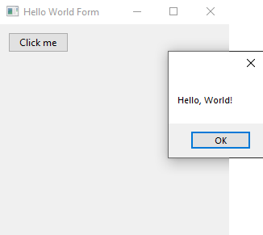
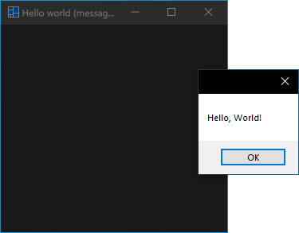
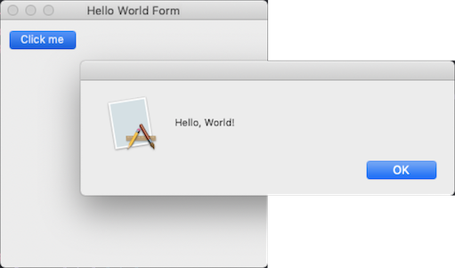
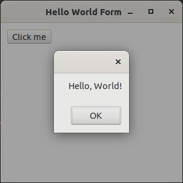
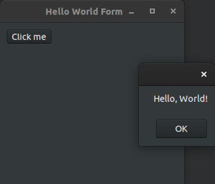

# xtd

**Modern C++17/20 framework to create console (CLI), forms (GUI like WinForms) and tunit (unit tests like Microsoft Unit Testing Framework) applications on Windows, macOS, Linux, iOS and android.**

[](https://gammasoft71.wixsite.com/xtdpro)

## Continuous Integration build status

| Operating system | Status                                                                                                                                |
|------------------|---------------------------------------------------------------------------------------------------------------------------------------|
| Windows          | [](https://ci.appveyor.com/project/gammasoft71/xtd) |
| macOS            | [](https://travis-ci.com/gammasoft71/xtd)                         |
| Linux            | [](https://circleci.com/gh/gammasoft71/xtd)                      |

## Features

* a collection of native C++ classes libraries, to complete std
* written in efficient, modern C++17 / C++20
* and highly portable and available on many different platforms (Windows, macOS, Linux, iOS and Android)
* API close to the .net API with a modern C++ approach and full integration with the std standard.
* [MIT License](https://github.com/gammasoft71/xtd/blob/master/docs/license.md)

For more information see:
* [website](https://gammasoft71.wixsite.com/xtdpro)
* [markdown documentations](https://github.com/gammasoft71/xtd/blob/master/docs/home.md)
* [sources](https://github.com/gammasoft71/xtd) 
* [project](https://sourceforge.net/projects/xtdpro/) 
* [Reference Guide](https://codedocs.xyz/gammasoft71/xtd/index.html)

## Examples

The classic first application 'Hello World'.

### Console (CLI)

hello_world_console.cpp:

```c++
#include <xtd/xtd>

using namespace xtd;

int main() {
  console::background_color(console_color::blue);
  console::foreground_color(console_color::white);
  console::write_line("Hello, World!");
}
```

CMakeLists.txt:

```cmake
cmake_minimum_required(VERSION 3.3)

project(hello_world_console)
find_package(xtd REQUIRED)
add_sources(hello_world_console.cpp)
target_type(CONSOLE_APPLICATION)
```

#### Build and run

Open "Command Prompt" or "Terminal". Navigate to the folder that contains the project and type the following:

```shell
xtdc run
```

#### Output

```
Hello, World!
```

### Forms (GUI like WinForms)

hello_world_forms.cpp:

```c++
#include <xtd/xtd>

using namespace xtd::forms;

class main_form : public form {
public:
  main_form() {
    text("Hello world (message_box)");

    button1.location({10, 10});
    button1.parent(*this);
    button1.text("&Click me");
    button1.click += [] {
      message_box::show("Hello, World!");
    };
  }
  
private:
  button button1;
};

int main() {
  application::run(main_form());
}
```

CMakeLists.txt:

```cmake
cmake_minimum_required(VERSION 3.3)

project(hello_world_forms)
find_package(xtd REQUIRED)
add_sources(hello_world_forms.cpp)
target_type(GUI_APPLICATION)
```

#### Build and run

Open "Command Prompt" or "Terminal". Navigate to the folder that contains the project and type the following:

```shell
xtdc run
```

#### Output

##### Windows :





##### macOS :




##### Linux Gnome :





### tunit (Unit tests like Microsoft Unit Testing Framework)

hello_world_test.cpp:

```c++
#include <xtd/xtd>
#include <string>

using namespace std;
using namespace xtd::tunit;

namespace unit_tests {
  class test_class_(hello_world_test) {
  public:
    void test_method_(create_string_from_literal) {
      string s = "Hello, World!";
      valid::are_equal(13, s.size());
      assert::are_equal("Hello, World!", s);
    }
    
    void test_method_(create_string_from_chars) {
      string s = {'H', 'e', 'l', 'l', 'o', ',', ' ', 'W', 'o', 'r', 'l', 'd', '!'};
      valid::are_equal(13, s.size());
      string_assert::starts_with("Hello,", s);
      string_assert::ends_with(" World!", s);
    }
  };
}

int main() {
  return console_unit_test().run();
}
```

CMakeLists.txt:

```cmake
cmake_minimum_required(VERSION 3.3)

project(hello_world_test)
find_package(xtd REQUIRED)
add_sources(hello_world_test.cpp)
target_type(TEST_APPLICATION)
```

#### Build and run

Open "Command Prompt" or "Terminal". Navigate to the folder that contains the project and type the following:

```shell
xtdc run
```

#### Output

```
Start 2 tests from 1 test case
Run tests:
  SUCCEED hello_world_test.create_string_from_literal (0 ms total)
  SUCCEED hello_world_test.create_string_from_chars (0 ms total)

Test results:
  SUCCEED 2 tests.
End 2 tests from 1 test case ran. (0 ms total)
```

## Getting Started

* [Installation](docs/downloads.md) provides download and install documentation.
* [Portability](docs/portability.md) provides information about C++, libraries dependency, Operating System suported, Compilators and Devepment Environment tools.
* [Examples](examples/README.md) provides some examples.
