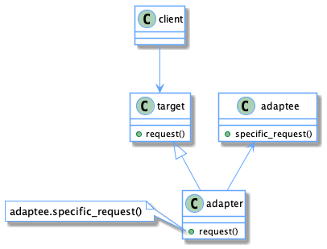

| [Home](home.md) | [Gallery](gallery.md) | [Examples](examples.md) | [Downloads](downloads.md) | [Documentation](documentation.md) | [Sources](https://github.com/gammasoft71/xtd) | [Project](https://sourceforge.net/projects/xtdpro/) | [Gammasoft](gammasoft.md)  | [Contact](contact.md) | [Website](https://gammasoft71.wixsite.com/xtdpro) |

# Adapter

The Adapter design pattern converts the interface of a class into another interface clients expect. This design pattern lets classes work together that couldn‘t otherwise because of incompatible interfaces.

Usage          Medium-high

## UML class diagram

A visualization of the classes and objects participating in this pattern.



## Sample code

This structural code demonstrates the Adapter pattern which maps the interface of one class onto another so that they can work together. These incompatible classes may come from different libraries or frameworks.

```c++

```

## Output

```

```

## See also
​
* [Common Design Patterns](common_design_patterns.md)
* [Design Guidelines](design_guidelines.md)
* [Documentation](documentation.md)

______________________________________________________________________________________________

© 2021 Gammasoft.
