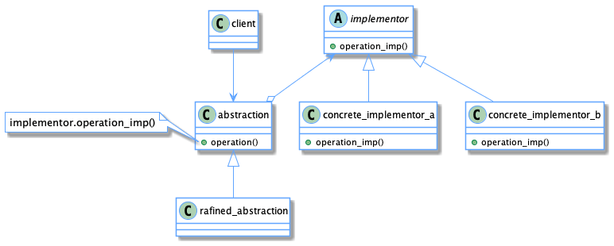

| [Home](home.md) | [Gallery](gallery.md) | [Examples](examples.md) | [Downloads](downloads.md) | [Documentation](documentation.md) | [Sources](https://github.com/gammasoft71/xtd) | [Project](https://sourceforge.net/projects/xtdpro/) | [Gammasoft](gammasoft.md)  | [Contact](contact.md) | [Website](https://gammasoft71.wixsite.com/xtdpro) |

# Bridge

# Definition

Decouple an abstraction from its implementation so that the two can vary independently.

Usage          Medium

# UML class diagram



# Sample code

This structural code demonstrates the Builder pattern in which complex objects are created in a step-by-step fashion. The construction process can create different object representations and provides a high level of control over the assembly of the objects.

```c++

```

# Output

```

```

# See also
​
* [Common Design Patterns](common_design_patterns.md)
* [Design Guidelines](design_guidelines.md)
* [Documentation](documentation.md)

______________________________________________________________________________________________

© 2021 Gammasoft.
