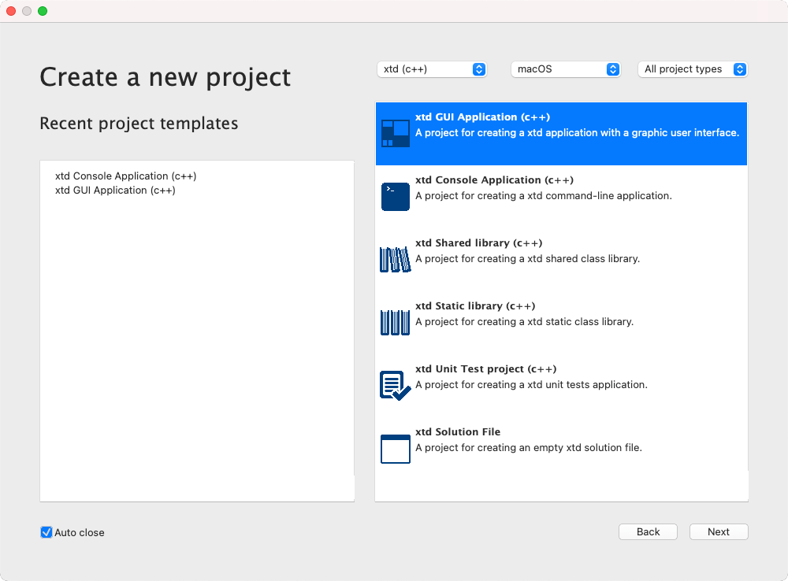
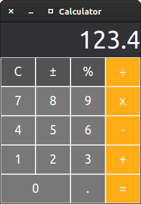
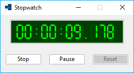

| [Home](home.md) | [News](news.md) | [Gallery](gallery.md) | [Examples](examples.md) | [Downloads](downloads.md) | [Documentation](documentation.md) | [Support](support.md) | [Sources](https://github.com/gammasoft71/xtd) | [Project](https://sourceforge.net/projects/xtdpro/) | [Gammasoft](gammasoft.md) | [Website](https://gammasoft71.github.io/xtd) |

# Gallery

## Minesweeper

[minesweeper](https://github.com/gammasoft71/xtd/blob/master/examples/xtd.forms.examples/games/minesweeper/README.md) is a cross-platform challenging game of strategy and luck.

## Game of Life

[game_of_life](https://github.com/gammasoft71/xtd/blob/master/examples/xtd.forms.examples/games/game_of_life/README.md) is not your typical computer game. It is a cross-platform 'cellular automaton', and was invented by Cambridge mathematician John Conway.

## xtdc-gui

[xtdc-gui](https://github.com/gammasoft71/xtd/blob/master/tools/xtdc-gui/README.md) is cross-platform project management GUI application.

## Calculator

[calculator](https://github.com/gammasoft71/xtd/blob/master/examples/xtd.forms.examples/others/calculator/README.md) is asimple cross-platform calculator example.

## Stopwatch

[stopwatch](https://github.com/gammasoft71/xtd/blob/master/examples/xtd.forms.examples/others/stopwatch_form/README.md) is a simple cross-platform stopwatch example.

## Painting

[painting](https://github.com/gammasoft71/xtd/blob/master/examples/xtd.forms.examples/others/painting/README.md) is a simple cross-platform painting example.

## Remarks

Your projects are welcome. If you want to add your project in this gallery, just send an email to [gammasoft](gammasoft71@gmail.com) with the screenshot and a brief description of your project and the links to find your project.

______________________________________________________________________________________________

© 2024 Gammasoft.
