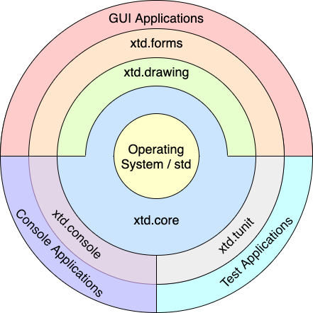

| [Home](home.md) | [Downloads](downloads.md) | [Examples](examples.md) | [Documentation](documentation.md) | [Sources](https://github.com/gammasoft71/xtd) | [Project](https://sourceforge.net/projects/xtdpro/) | [Contact](contact.md) | [Gammasoft](https://gammasoft71.wixsite.com/gammasoft) |

# xtd is ...

💾 Modern c++17 libraries to create console, gui and unit test applications.

# Features

* a collection of native C++ classes libraries, to complete std;
* written in efficient, modern C++17;
* and highly portable and available on many different platforms (Windows, macOS, Linux, iOS and android);

# Libraries

xtd is composed of several libraries grouped by theme :

## xtd.tunit

|                                                                                                               | Libraries                                                          | Github sources                                            | Examples                                                                        | Reference guide                                          |
|---------------------------------------------------------------------------------------------------------------|--------------------------------------------------------------------|-----------------------------------------------------------|---------------------------------------------------------------------------------|----------------------------------------------------------|
|                    | [xtd.tunit](https://gammasoft71.wixsite.com/xtd-tunit)             | [sources](https://github.com/gammasoft71/xtd_tunit)       | [examples](https://github.com/gammasoft71/xtd_tunit/tree/master/examples)       | [ref](https://codedocs.xyz/gammasoft71/xtd_tunit/)       |

## xtd.properties

|                                                                                                               | Libraries                                                          | Github sources                                            | Examples                                                                        | Reference guide                                          |
|---------------------------------------------------------------------------------------------------------------|--------------------------------------------------------------------|-----------------------------------------------------------|---------------------------------------------------------------------------------|----------------------------------------------------------|
|     | [xtd.properties](https://gammasoft71.wixsite.com/xtd-properties)   | [sources](https://github.com/gammasoft71/xtd_properties)  | [examples](https://github.com/gammasoft71/xtd_properties/tree/master/examples)  | [ref](https://codedocs.xyz/gammasoft71/xtd_properties/)  |

## xtd.core

|                                                                                                               | Libraries                                                          | Github sources                                            | Examples                                                                        | Reference guide                                          |
|---------------------------------------------------------------------------------------------------------------|--------------------------------------------------------------------|-----------------------------------------------------------|---------------------------------------------------------------------------------|----------------------------------------------------------|
|        | [xtd.delegates](https://gammasoft71.wixsite.com/xtd-delegates)     | [sources](https://github.com/gammasoft71/xtd_delegates)   | [examples](https://github.com/gammasoft71/xtd_delegates/tree/master/examples)   | [ref](https://codedocs.xyz/gammasoft71/xtd_delegates/)   |
|  | [xtd.diagnostics](https://gammasoft71.wixsite.com/xtd-diagnostics) | [sources](https://github.com/gammasoft71/xtd_diagnostics) | [examples](https://github.com/gammasoft71/xtd_diagnostics/tree/master/examples) | [ref](https://codedocs.xyz/gammasoft71/xtd_diagnostics/) |
|                             | [xtd.io](https://gammasoft71.wixsite.com/xtd-io)                   | [sources](https://github.com/gammasoft71/xtd_io)          | [examples](https://github.com/gammasoft71/xtd_io/tree/master/examples)          | [ref](https://codedocs.xyz/gammasoft71/xtd_io/)          |
|              | [xtd.strings](https://gammasoft71.wixsite.com/xtd-strings)         | [sources](https://github.com/gammasoft71/xtd_strings)     | [examples](https://github.com/gammasoft71/xtd_strings/tree/master/examples)     | [ref](https://codedocs.xyz/gammasoft71/xtd_strings/)     |
|                 | [xtd.system](https://gammasoft71.wixsite.com/xtd-system)           | [sources](https://github.com/gammasoft71/xtd_system)      | [examples](https://github.com/gammasoft71/xtd_system/tree/master/examples)      | [ref](https://codedocs.xyz/gammasoft71/xtd_environment/) |

## xtd.console

|                                                                                                               | Libraries                                                          | Github sources                                            | Examples                                                                        | Reference guide                                          |
|---------------------------------------------------------------------------------------------------------------|--------------------------------------------------------------------|-----------------------------------------------------------|---------------------------------------------------------------------------------|----------------------------------------------------------|
|              | [xtd.console](https://gammasoft71.wixsite.com/xtd-console)         | [sources](https://github.com/gammasoft71/xtd_console)     | [examples](https://github.com/gammasoft71/xtd_console/tree/master/examples)     | [ref](https://codedocs.xyz/gammasoft71/xtd_console/)     |

## xtd.forms

|                                                                                                               | Libraries                                                          | Github sources                                            | Examples                                                                        | Reference guide                                          |
|---------------------------------------------------------------------------------------------------------------|--------------------------------------------------------------------|-----------------------------------------------------------|---------------------------------------------------------------------------------|----------------------------------------------------------|
|              | [xtd.drawing](https://gammasoft71.wixsite.com/xtd-drawing)         | [sources](https://github.com/gammasoft71/xtd_drawing)     | [examples](https://github.com/gammasoft71/xtd_drawing/tree/master/examples)     | [ref](https://codedocs.xyz/gammasoft71/xtd_drawing/)     |
|                    | [xtd.forms](https://gammasoft71.wixsite.com/xtd-forms)             | [sources](https://github.com/gammasoft71/xtd_forms)       | [examples](https://github.com/gammasoft71/xtd_forms/tree/master/examples)       | [ref](https://codedocs.xyz/gammasoft71/xtd_forms/)       |

# Platforms

* Windows
* macOS X
* Linux
* Probably others

# Compilers

* Visual studio 2017
* clang Apple LLVM version 10.0.0 (clang-1000.11.45.5) - Xcode 10.1
* g++ 7

______________________________________________________________________________________________

© 2019 Gammasoft.
