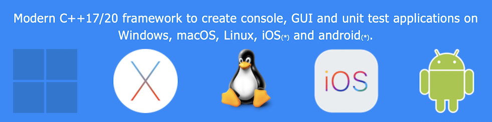
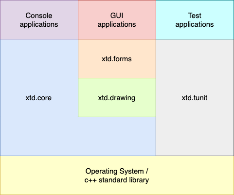

| [Home](home.md) | [News](news.md) | [Gallery](gallery.md) | [Examples](examples.md) | [Downloads](downloads.md) | [Documentation](documentation.md) | [Sources](https://github.com/gammasoft71/xtd) | [Project](https://sourceforge.net/projects/xtdpro/) | [Gammasoft](gammasoft.md)  | [Contact](contact.md) | [Website](https://gammasoft71.wixsite.com/xtdpro) |

(*) See [portability](portability.md#the-xtd-libraries-portability-list) for more information

# Latest news

* [Release xtd 0.1.0 (beta) - October 10, 2021](news.md#release-xtd-010-beta-october-10-2021) 

# xtd is ...

* a collection of native C++ classes libraries, to complete std;
* API close to the .net API with a modern C++ approach and full integration with the std standard;
* written in efficient, modern C++17/20 with [RAII](https://en.wikipedia.org/wiki/Resource_acquisition_is_initialization) programming idiom;
* and [highly portable](portability.md#the-xtd-libraries-portability-list) and available on [many different platforms](portability.md#operating-system-supported);

# ... composed of several libraries

These libraries are grouped by theme :

- **system** : The *xtd.core* library is modern C++17/20 libraries of classes, interfaces, and value types that provide access to system functionality. It is the foundation on which c++ applications, components, and controls are built.
- **drawing** : The *xtd.drawing* library contains types that support basic GDI+ graphics functionality. Child namespaces support advanced two-dimensional and vector graphics functionality, advanced imaging functionality, and print-related and typographical services. A child namespace also contains types that extend design-time user-interface logic and drawing.
- **forms** : The *xtd.forms* library contains classes for creating Windows-based applications that take full advantage of the rich user interface features available in the Microsoft Windows, Apple macOS and linux base operating system.
- **tunit** : The *xtd.tunit* library is a unit-testing framework for modern C++17/20. Initially ported from [Microsoft.VisualStudio.TestTools.Cpp](https://docs.microsoft.com/en-us/visualstudio/test/microsoft-visualstudio-testtools-cppunittestframework-api-reference).

See [xtd libraries hierarchy](hierarchy.md).

# Objectives and Mission

* xtd is a powerful, yet easy to use platform to build your applications upon
* xtd allows you to build highly portable applications (write once – compile and run anywhere)
* xtd is modular and scalable from embedded applications
* xtd provides consistent, comprehensive and comprehensible programming interfaces
* xtd favors simplicity over complexity ("as simple as possible, but not simpler")
* xtd aims for consistency in design, coding style and documentation
* xtd emphasizes source code quality, in terms of readability, comprehensiveness, consistency, style and testability
* xtd aims to make C++ programming fun again Guiding Principles
* Strong focus on code quality, style, consistency and code readability –all code must satisfy our coding style guide
* Strong focus on tests (automated unit tests with high coverage)
* Build on top of solid foundations – use existing proven C, C++ or Objective-C libraries (e.g. Win32 APi, Gtk4, AppKit,...) where it makes sense

# Getting Started

* [Installation](downloads.md) provides download and install documentation.
* [Portability](portability.md) provides information about C++, libraries dependency, Operating System supported, Compilers and Development Environment tools.
* [Examples](../examples/README.md) provides some examples.

______________________________________________________________________________________________

© 2021 Gammasoft.
