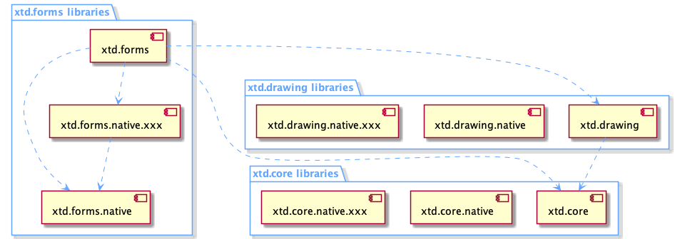
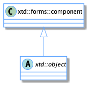
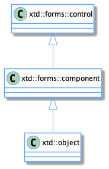

# xtd.forms explanations (**Internal use only**)

## Table of contents
* [Libraries and API](#libraries-and-api)
  * [xtd.forms high level API](#xtdforms-high-level-api)
  * [xtd.forms.native low level API](#xtdformsnative-low-level-api)
* [Components](#components)
* [Controls](#controls)
  * [Parent and childs](#parent-and-childs)
  * [Creation](#creation)
  * [Update](#update)
  * [Destruction](#destruction)
* [Containers](#containers)
  * [Scrollables](#scrollables)
  * [Layauts](#layauts)
* [Forms](#forms)
  * [Form](#form)
  * [MDI and child](#mdi-and-child)
  * [dialog](#dialog)
* [Events](#events)
  * [Virtual and event](#virtual-and-event)
  * [Keyboard](#keyboard)
  * [Mouse](#mouse)
  * [Paint](#paint)
  * [Other Events](#other-events)
* [Graphics](#graphics)
* [Sizes](#sizes)
* [Ambient properties](#ambient-properties)
* [Dock and anchor](#dock-and-anchor)
* [Themes](#themes)
  * [Control style](#control-style)
  * [Dialog style](#dialog-style)
* [Resources](#resources)
* [Settings](#settings)

## Libraries and API

Like the whole xtd framework, **xtd.forms **provides a high level API for the user and uses a low level API to communicate in this case a graphical toolkit:
 * **xtd.forms** : high level API.
 * **xtd.forms.native** : low level API.

### Hierarchy diagram for xtd.forms



### xtd.forms high level API

**xtd.forms** offers all the advantages of an API in modern C++ 17/20.

**xtd.forms** contains a large amount of objects such as: 
 * controls
 * containers
 * components
 * and many more  

**xtd.forms** has its own design, its own hierarchy and its own nomenclature.

**xtd.forms** handles all the high level functionality without going through the **xtd.forms.native** API. However, as soon as **xd.froms** needs to access a (native) system resource like creating a control, it will use the **xtd.forms.native** API.

### xtd.forms.native low level API

**xtd.forms.native** provides a low level API through static functions grouped by themes.

The role of this API is the same as that of the Java JVM API or the Common Language Runtime (CLR) of the .Net Framework.

The structure is still the same as for **xtd.native** or **xtd.drawing.native** :

Static functions contained in static classes like this :

```c++
namespace xtd {
  namepsace forms {
    class control static_ {
    protected:
      static intptr_t create(const create_params& create_params);
      // ...
    };
  }
}
```

or this :

```c++
namespace xtd {
  namepsace forms {
    class button static_ {
    protected:
      static void set_default_button(intptr_t control);
    };
  }
}
```

**xtd.forms.native** is an interface library, there are no implementations and therefore no source files.

Only headers with function declarations.

**xtd.forms.native** does not know the objects of **xtd.forms** because it is used by **xtd.forms** and not the other way around.

By design, it does not know the objects of **xtd.forms.native.xxx**. Since the purpose of this interface is to completely isolate the **xtd.forms** and **xtd.forms.native.xxx** libraries.

On the other hand **xtd.forms.native** knows the objects of **xtd.core** and **xtd.drawing** since it uses them.

All the objects of **xtd.forms.native.xxx** are transformed in intptr_t.

For example :

For using the function **set_default_button**

**xtd.forms.native** defines it as follows:

```c++
void xtd::forms::native::button::set_default_button(intptr_t control);
```

**xtd.form** uses it as follows:

```c++
void xtd::forms::form::set_default_button(const xtd::forms::form::button& button) {
  xtd::forms::native::button::set_default_button(button.handle());
}
```

**xtd.form.native.xxx** implements it as follows:

```c++
void xtd::forms::native::button::set_default_button(intptr_t control) {
  reinterpret_cast<Toolkit::Button*>(control)->SetDefaultBuutton(true);
}
```

**Remarks**

The **xxx** of the library **xtd.forms.native.xxx** can be replaced by **wxwdigets**. End in tthe future by **qt6** or **sdl2** or others.

## Components

### Component type

A componant provides the base implementation and enables object sharing between applications.

A component is an integral part of xtd.forms but unlike a control, a component has no graphical interface.

It will be mainly used in the future with the xdd-code<sup>1</sup> designer

<sup>1</sup> xtd-code : code editor and designer for xtd.

### Component class diagram



All controls inherit from component.

### Components

There are several components in **xtd.forms** : xtd::forms::timer, xttd::forms::background_worker, ...

## Controls

### Control type

Defines the base class for controls, which are components with visual representation.

Unlike a component, a control always has a graphic interface.

#### control class diagram



The control class provides all properties, functions and events common to the different controls. It also provides some static functions to manipulate the controls.

### Controls

The controls do not have the same completeness. They could be classified in different categories like this:

* Simple controls : xtd::forms::label, xtd::forms::button, xtd::forms::text_box, ...
* List controls : xtd::forms::combo_box, xtd::forms::list_box, ...
* Picker controls : xtd::forms::color_picker, xtd::forms::date_time_picker, ...
* Complex controls : xtd::forms::list_view, xtd::forms::tree_view, xtd::forms::rich_text_box, ...

### Parent and childs

### Creation

### Update

### Destruction

## Containers

### Scrollables

### Layauts

## Forms

### Form

### MDI and child

### Dialog

## Events

### Virtual and event

### Keyboard

### Mouse

### Paint

### Other Events

## Graphics

## Sizes

## Ambient properties

## Dock and anchor

## Themes

### Control style

### Dialog style

## Resources

## Settings
