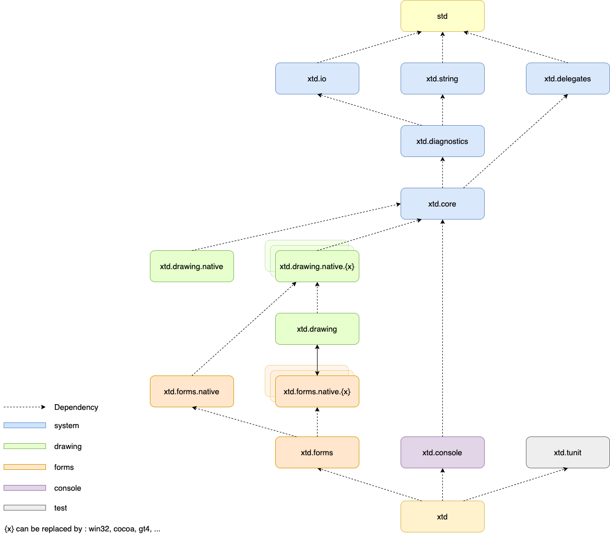

| [Home](home.md) | [Downloads](downloads.md) | [Examples](examples.md) | [Documentation](documentation.md) | [Sources](https://github.com/gammasoft71/xtd) | [Project](https://sourceforge.net/projects/xtdpro/) | [Contact](contact.md) | [Gammasoft](https://gammasoft71.wixsite.com/gammasoft) |

# xtd is ...

💾 Modern c++17 libraries to create console, gui and unit test applications.

# Features

* a collection of native C++ classes libraries, to complete std;
* written in efficient, modern C++17;
* and highly portable and available on many different platforms (Windows, macOS, Linux, iOS and android);

# Libraries

xtd is composed of several libraries grouped by theme :

## xtd.tunit

The xtd.tunit library is a unit-testing framework for modern C++17. Initially ported from [Microsoft.VisualStudio.TestTools.Cpp](https://docs.microsoft.com/en-us/visualstudio/test/microsoft-visualstudio-testtools-cppunittestframework-api-reference).
 
|                                                                                                               | Libraries                                             | Examples                                                                        | Reference guide                                             |
|---------------------------------------------------------------------------------------------------------------|-------------------------------------------------------|---------------------------------------------------------------------------------|-------------------------------------------------------------|
|                         | [xtd.tunit](https://github.com/gammasoft71/xtd_tunit) | [examples](https://github.com/gammasoft71/xtd_tunit/tree/master/examples)       | [codedocs.xyz](https://codedocs.xyz/gammasoft71/xtd_tunit/) |

## xtd.properties

The xtd.properties is another c#-like property accessor for C++11 and above.

|                                                                                                               | Libraries                                                       | Examples                                                                        | Reference guide                                                  |
|---------------------------------------------------------------------------------------------------------------|-----------------------------------------------------------------|---------------------------------------------------------------------------------|------------------------------------------------------------------|
|          | [xtd.properties](https://github.com/gammasoft71/xtd_properties) | [examples](https://github.com/gammasoft71/xtd_properties/tree/master/examples)  | [codedocs.xyz](https://codedocs.xyz/gammasoft71/xtd_properties/) |

## xtd.system

The xtd.core, xtd.delegates, xtd.diagnostics, xtd.io and xtd.strings libraries are modern C++17 libraries of classes, interfaces, and value types that provide access to system functionality. It is the foundation on which c++ applications, components, and controls are built.

|                                                                                                               | Libraries                                                         | Examples                                                                        | Reference guide                                                   |
|---------------------------------------------------------------------------------------------------------------|-------------------------------------------------------------------|---------------------------------------------------------------------------------|-------------------------------------------------------------------|
|                            | [xtd.core](https://github.com/gammasoft71/xtd_core)               | [examples](https://github.com/gammasoft71/xtd_core/tree/master/examples)        | [codedocs.xyz](https://codedocs.xyz/gammasoft71/xtd_core/)        |
|             | [xtd.delegates](https://github.com/gammasoft71/xtd_delegates)     | [examples](https://github.com/gammasoft71/xtd_delegates/tree/master/examples)   | [codedocs.xyz](https://codedocs.xyz/gammasoft71/xtd_delegates/)   |
|       | [xtd.diagnostics](https://github.com/gammasoft71/xtd_diagnostics) | [examples](https://github.com/gammasoft71/xtd_diagnostics/tree/master/examples) | [codedocs.xyz](https://codedocs.xyz/gammasoft71/xtd_diagnostics/) |
|                                  | [xtd.io](https://github.com/gammasoft71/xtd_io)                   | [examples](https://github.com/gammasoft71/xtd_io/tree/master/examples)          | [codedocs.xyz](https://codedocs.xyz/gammasoft71/xtd_io/)          |
|                   | [xtd.strings](https://github.com/gammasoft71/xtd_strings)         | [examples](https://github.com/gammasoft71/xtd_strings/tree/master/examples)     | [codedocs.xyz](https://codedocs.xyz/gammasoft71/xtd_strings/)     |

## xtd.console

The xtd.console library is modern c++17 library to manage console application on Windows, macOS and Linux.

|                                                                                              | Libraries                                             | Examples                                                                        | Reference guide                                               |
|----------------------------------------------------------------------------------------------|-------------------------------------------------------|---------------------------------------------------------------------------------|---------------------------------------------------------------|
|  | [xtd.console](https://github.com/gammasoft71/xtd_console) | [examples](https://github.com/gammasoft71/xtd_console/tree/master/examples) | [codedocs.xyz](https://codedocs.xyz/gammasoft71/xtd_console/) |

## xtd.forms

The xrd.drawing library contains types that support basic GDI+ graphics functionality. Child namespaces support advanced two-dimensional and vector graphics functionality, advanced imaging functionality, and print-related and typographical services. A child namespace also contains types that extend design-time user-interface logic and drawing.

The xtd.forms library contains classes for creating Windows-based applications that take full advantage of the rich user interface features available in the Microsoft Windows, Apple macOS and linux base operating system.

|                                                                                              | Libraries                                             | Examples                                                                        | Reference guide                                               |
|----------------------------------------------------------------------------------------------|-------------------------------------------------------|---------------------------------------------------------------------------------|---------------------------------------------------------------|
|  | [xtd.drawing](https://github.com/gammasoft71/xtd_drawing) | [examples](https://github.com/gammasoft71/xtd_drawing/tree/master/examples)     | [codedocs.xyz](https://codedocs.xyz/gammasoft71/xtd_drawing/) |
|        | [xtd.forms](https://github.com/gammasoft71/xtd_forms)   | [examples](https://github.com/gammasoft71/xtd_forms/tree/master/examples)       | [codedocs.xyz](https://codedocs.xyz/gammasoft71/xtd_forms/)   |

______________________________________________________________________________________________

© 2020 Gammasoft.
