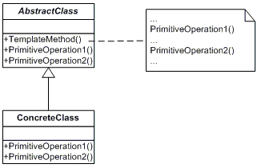

| [Home](home.md) | [News](news.md) | [Gallery](gallery.md) | [Examples](examples.md) | [Downloads](downloads.md) | [Documentation](documentation.md) | [Sources](https://github.com/gammasoft71/xtd) | [Project](https://sourceforge.net/projects/xtdpro/) | [Gammasoft](gammasoft.md)  | [Contact](contact.md) | [Website](https://gammasoft71.wixsite.com/xtdpro) |

# Template Method

The Template Method design pattern defines the skeleton of an algorithm in an operation, deferring some steps to subclasses. This pattern lets subclasses redefine certain steps of an algorithm without changing the algorithm‘s structure.

Usage          Medium

## UML class diagram

A visualization of the classes and objects participating in this pattern.



## Sample code

This structural code ddemonstrates the Template Method which provides a skeleton calling sequence of methods. One or more steps can be deferred to subclasses which implement these steps without changing the overall calling sequence.This structural code ddemonstrates the Template Method which provides a skeleton calling sequence of methods. One or more steps can be deferred to subclasses which implement these steps without changing the overall calling sequence.

```c++

```

## Output

```

```

## See also
​
* [Common Design Patterns](common_design_patterns.md)
* [Design Guidelines](design_guidelines.md)
* [Documentation](documentation.md)

______________________________________________________________________________________________

© 2021 Gammasoft.
