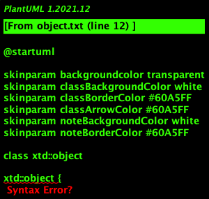
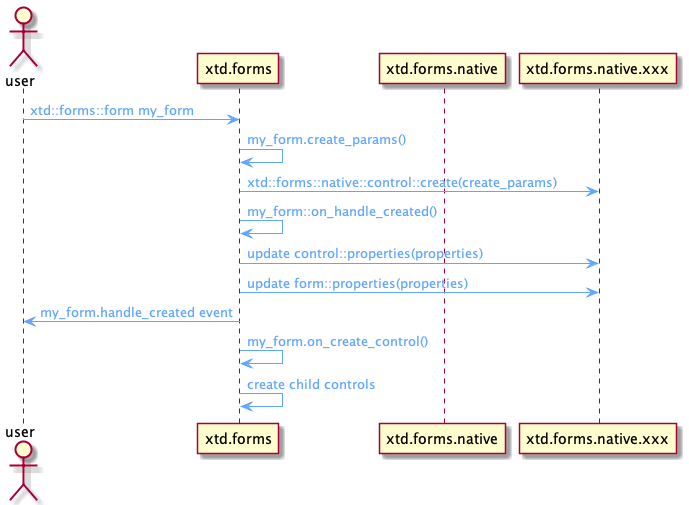
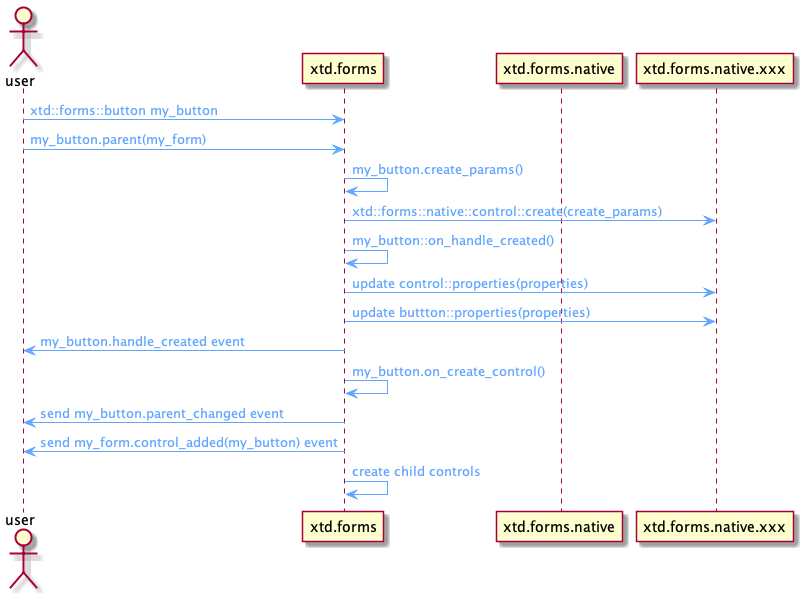
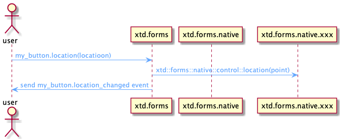
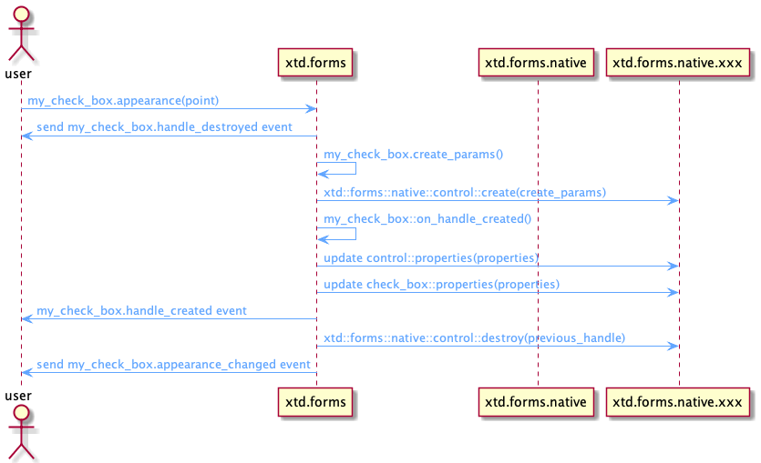
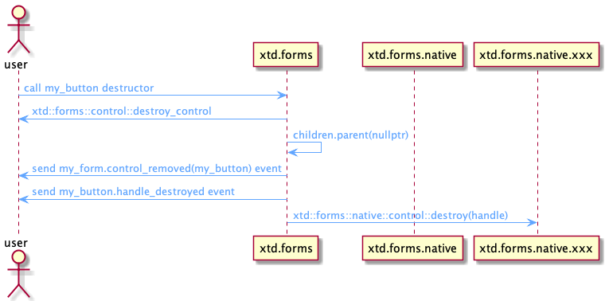
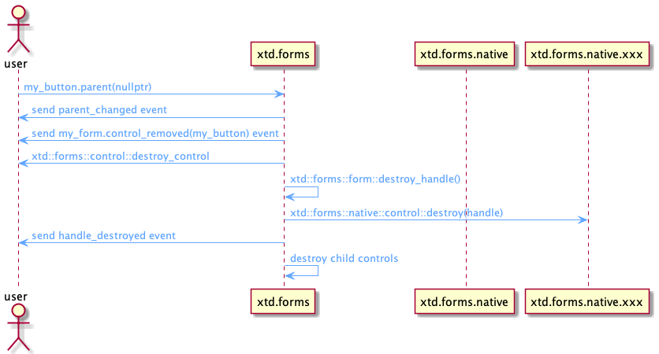
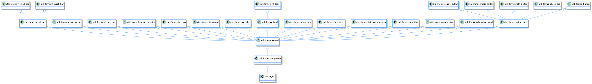
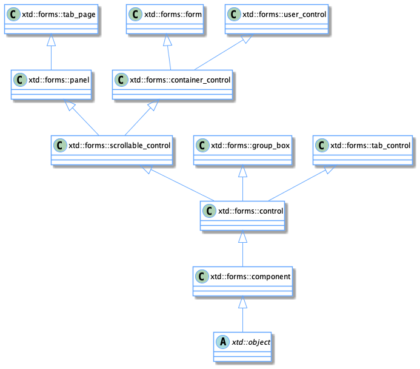
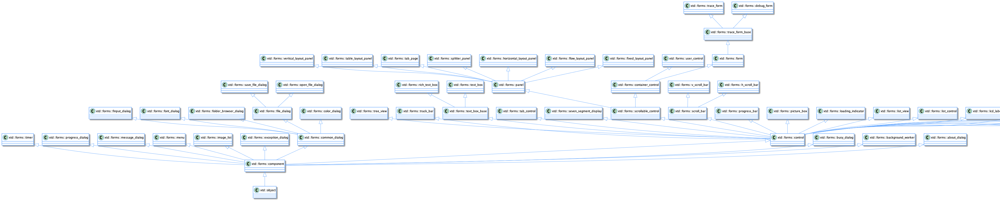

| [Home](home.md) | [News](news.md) | [Gallery](gallery.md) | [Examples](examples.md) | [Downloads](downloads.md) | [Documentation](documentation.md) | [Support](support.md) | [Sources](https://github.com/gammasoft71/xtd) | [Project](https://sourceforge.net/projects/xtdpro/) | [Gammasoft](gammasoft.md) | [Website](https://gammasoft71.github.io/xtd) |

# xtd.forms overview

## Table of contents
* [Libraries and API](#libraries-and-api)
  * [xtd.forms hierarchy diagram](#xtdforms-hierarchy-diagram)
  * [xtd.forms high level API](#xtdforms-high-level-api)
  * [xtd.forms.native low level API](#xtdformsnative-low-level-api)
* [Objects](#cobjects)
  * [Object type](#cobject-type)
  * [Object class diagram](#object-class-diagram)
* [Components](#components)
  * [Component type](#component-type)
  * [Component class diagram](#component-class-diagram)
  * [Component objects](#component-objects)
* [Controls](#controls)
  * [Control type](#control-type)
  * [Control class diagram](#control-class-diagram)
  * [Control objects](#control-objects)
  * [Parent and children](#parent-and-children)
    * [Add parent](#add-parent)
    * [Remove parent](#remove-parent)
    * [Update parent](#update-parent)
  * [Control operations](#control-operations)
    * [Create control](#create-control)
    * [Update control](#update-control)
    * [Destroy control](#destroy-control)
    * [Control and user control](#control-and-user-control)
  *  [Some controls class diagram](#some-controls-class-diagram)
* [Containers](#containers)
  * [Container control class diagram](#container-control-class-diagram)
  * [Scrollables](#scrollables)
    * [Scrollable control class diagram](#container-control-class-diagram)
  * [Layouts](#layouts)
  * [Some container controls class diagram](#some-container-controls-class-diagram)
* [Forms](#forms)
  * [Show](#show)
  * [Start position](#start-position)
  * [Window state](#window-state)
  * [Form](#form)
  * [Form class diagram](#form-class-diagram)
  * [MDI and child](#mdi-and-child)
  * [dialog](#dialog)
* [Events](#events)
  * [Local evants](#local-events)
  * [System events](#system-events)
  * [Keyboard](#keyboard)
  * [Mouse](#mouse)
  * [Focus](#focus)
  * [Paint](#paint)
  * [Other Events](#other-events)
* [Graphics](#graphics)
* [Size and location properties](#size-and-location-properties)
* [Ambient properties](#ambient-properties)
* [Position and layout of controls](#position-and-layout-of-controls)
  * [Fixed position and size](#fixed-position-and-size)
  * [Margin and Padding](#margin-and-padding)
  * [Automatic placement and size](#automatic-placement-and-size)
    * [Dock](#dock)
    * [anchor](#anchor)
    * [Automatic sizing](#automatic-sizing)
* [Themes](#themes)
* [Styles](#styles)
  * [Control style](#control-style)
  * [Dialog style](#dialog-style)
* [Resources](#resources)
* [Settings](#settings)
* [Translation](#translation)
* [Some xtd.forms class diagram](#some-xtdforms-class-diagram)

## Libraries and API

Like the whole [xtd framework](xtd_explanations.md), **xtd.forms** provides a high level API for the user and uses a low level API to communicate, in this case, with a graphical toolkit:
 * **xtd.forms** : high level API.
 * **xtd.forms.native** : low level API.

### xtd.forms hierarchy diagram


### xtd.forms high level API

**xtd.forms** offers all the advantages of an API in modern C++ 17/20.

**xtd.forms** contains a large amount of objects such as: 
 * components
 * controls
 * containers
 * forms
 * dialogs
 * and many more  

**xtd.forms** has its own design, its own hierarchy and its own nomenclature.

**xtd.forms** handles all the high level functionality without going through the **xtd.forms.native** API. However, as soon as **xd.froms** needs to access a (native) system resource like creating a control, it will use the **xtd.forms.native** API.

### xtd.forms.native low level API

**xtd.forms.native** provides a low level API through static functions grouped by themes.

The role of this API is the same as that of the Java JVM API or the Common Language Runtime (CLR) of the .Net Framework.

The structure is still the same as for **xtd.core.native** or **xtd.drawing.native** :

Static functions contained in static classes like this :

```cpp
namespace xtd {
  namespace forms {
    namespace native {
      class control static_ {
      protected:
        static intptr_t create(const create_params& create_params);
        // ...
      };
    }
  }
}
```

or this :

```cpp
namespace xtd {
  namespace forms {
    namespace native {
      class button static_ {
      protected:
        static void set_default_button(intptr_t control);
      };
    }
  }
}
```

**Remarks :** All methods are protected. This allows to forbid a user to call one of these functions.

**xtd.forms.native** is an interface library, there are no implementations and therefore no source files.

Only headers with function declarations.

**xtd.forms.native** does not know the objects of **xtd.forms** because it is used by **xtd.forms** and not the other way around.

By design, it does not know the objects of **xtd.forms.native.xxx**. Since the purpose of this interface is to completely isolate the **xtd.forms** and **xtd.forms.native.xxx** libraries.

On the other hand **xtd.forms.native** knows the objects of **xtd.core** and **xtd.drawing** since it uses them.

All the objects of **xtd.forms.native.xxx** are transformed in intptr_t.

For example :

For using the function **set_default_button**

**xtd.forms.native** defines it as follows:

```cpp
void xtd::forms::native::button::set_default_button(intptr_t control);
```

**xtd.form** uses it as follows:

```cpp
void xtd::forms::form::set_default_button(const xtd::forms::form::button& button) {
  xtd::forms::native::button::set_default_button(button.handle());
}
```

**xtd.form.native.xxx** implements it as follows:

```cpp
void xtd::forms::native::button::set_default_button(intptr_t control) {
  reinterpret_cast<Toolkit::Button*>(control)->SetDefaultBuutton(true);
}
```

**Remarks :** The **xxx** of the library **xtd.forms.native.xxx** can be replaced by **wxwdigets**. End in tthe future by **qt6** or **sdl2** or others.

## Objects

All classes of the framework inherit from the class xtd::object.

### Object type

[xtd::object](https://github.com/gammasoft71/xtd/blob/master/src/xtd.core/include/xtd/object.h) supports all classes in the xtd class hierarchy and provides low-level services to derived classes.
This is the ultimate base class of all classes in the xtd.
It is the root of the type hierarchy.

### Object class diagram



## Components

### Component type

A [xtd::forms::componant](https://github.com/gammasoft71/xtd/blob/master/src/xtd.forms/include/xtd/forms/componant.h) provides the base implementation and enables object sharing between applications.

A [xtd::forms::componant](https://github.com/gammasoft71/xtd/blob/master/src/xtd.forms/include/xtd/forms/componant.h) is an integral part of xtd.forms but unlike a [xtd::forms::control](https://github.com/gammasoft71/xtd/blob/master/src/xtd.forms/include/xtd/forms/controol.h), a [xtd::forms::componant](https://github.com/gammasoft71/xtd/blob/master/src/xtd.forms/include/xtd/forms/componant.h) has no graphical interface.

It will be mainly used in the future with the xtd-code<sup>1</sup> designer

<sup>1</sup> xtd-code : code editor and designer for xtd.

### Component class diagram


All controls inherit from [xtd::forms::componant](https://github.com/gammasoft71/xtd/blob/master/src/xtd.forms/include/xtd/forms/componant.h).

### Component objects

There are several components in **xtd.forms** : [xtd::forms::timer](https://github.com/gammasoft71/xtd/blob/master/src/xtd.forms/include/xtd/forms/timer.h), [xtd::forms::background_worker](https://github.com/gammasoft71/xtd/blob/master/src/xtd.forms/include/xtd/forms/background_workerr.h), ...

## Controls

### Control type

Defines the base class for controls, which are components with visual representation.

Unlike a component, a control always has a graphic interface.

### Control class diagram


The control class provides all properties, functions and [events](events.md) common to the different controls. It also provides some static functions to manipulate the controls.

### Control objects

The controls do not have the same completeness. They could be classified in different categories like this:

* Simple controls : [xtd::forms::label](https://github.com/gammasoft71/xtd/blob/master/src/xtd.forms/include/xtd/forms/label.h), [xtd::forms::button](https://github.com/gammasoft71/xtd/blob/master/src/xtd.forms/include/xtd/forms/button.h), [xtd::forms::text_box](https://github.com/gammasoft71/xtd/blob/master/src/xtd.forms/include/xtd/forms/text_box.h), ...
* List controls : [xtd::forms::combo_box](https://github.com/gammasoft71/xtd/blob/master/src/xtd.forms/include/xtd/forms/combo_box.h), [xtd::forms::list_box](https://github.com/gammasoft71/xtd/blob/master/src/xtd.forms/include/xtd/forms/list_box.h), ...
* Picker controls : [xtd::forms::color_picker](https://github.com/gammasoft71/xtd/blob/master/src/xtd.forms/include/xtd/forms/color_picker.h), [xtd::forms::date_time_picker](https://github.com/gammasoft71/xtd/blob/master/src/xtd.forms/include/xtd/forms/date_time_picjer.h), ...
* Complex controls : [xtd::forms::list_view](https://github.com/gammasoft71/xtd/blob/master/src/xtd.forms/include/xtd/forms/list_view.h), [xtd::forms::tree_view](https://github.com/gammasoft71/xtd/blob/master/src/xtd.forms/include/xtd/forms/tree_wiew.h), [xtd::forms::rich_text_box](https://github.com/gammasoft71/xtd/blob/master/src/xtd.forms/include/xtd/forms/rich_text_box.h), ...

An [xtd::forms::control](https://github.com/gammasoft71/xtd/blob/master/src/xtd.forms/include/xtd/forms/control.h) can be instantiated in the same way as another control.

### Parent and children

All controls must have a parent, except [xtd::forms::form](https://github.com/gammasoft71/xtd/blob/master/src/xtd.forms/include/xtd/forms/form.h) which cannot have one (An exception [xtd::invalid_operation_exception](https://github.com/gammasoft71/xtd/blob/master/src/xtd.core/include/xtd/invalid_operation_exception.h) will be generated if you try).

A control must always have one and only one parent (except for [xtd::forms::form](https://github.com/gammasoft71/xtd/blob/master/src/xtd.forms/include/xtd/forms/form.h) which can't have any). But a parent can have several child controls.

Any control can be a parent and/or a child. There are no restrictions.

It is easy to imagine that a complex control needs several simple controls.
Like for example [xtd::forms::domain_up_down](https://github.com/gammasoft71/xtd/blob/master/src/xtd.forms/include/xtd/forms/domain_up_down.h) is composed of an [xtd::forms::text_box](https://github.com/gammasoft71/xtd/blob/master/src/xtd.forms/include/xtd/forms/text_box.h) and an [xtd::forms::up_down_button](https://github.com/gammasoft71/xtd/blob/master/src/xtd.forms/include/xtd/forms/up_down_button.h).
And that an [xtd::forms::form](https://github.com/gammasoft71/xtd/blob/master/src/xtd.forms/include/xtd/forms/form.h) or an [xtd::forms::panel](https://github.com/gammasoft71/xtd/blob/master/src/xtd.forms/include/xtd/forms/pane.h) can contain an [xtd::forms::domain_up_down](https://github.com/gammasoft71/xtd/blob/master/src/xtd.forms/include/xtd/forms/domain_up_down.h). 
In this case our [xtd::forms::domain_up_down](https://github.com/gammasoft71/xtd/blob/master/src/xtd.forms/include/xtd/forms/domain_up_down.h) is a parent for [xtd::forms::text_box](https://github.com/gammasoft71/xtd/blob/master/src/xtd.forms/include/xtd/forms/text_box.h) and [xtd::forms::up_down_button](https://github.com/gammasoft71/xtd/blob/master/src/xtd.forms/include/xtd/forms/up_down_button.h) and at the same time is a child for [xtd::forms::form](https://github.com/gammasoft71/xtd/blob/master/src/xtd.forms/include/xtd/forms/form.h) or [xtd::forms::panel](https://github.com/gammasoft71/xtd/blob/master/src/xtd.forms/include/xtd/forms/panel.h).

You can retrieve or assign a parent to a control using the [xtd::forms::control::parent](https://github.com/gammasoft71/xtd/blob/master/src/xtd.forms/include/xtd/forms/control.h) property or by assigning the control to the parent by adding it to the [xtd::forms::control::controls](https://github.com/gammasoft71/xtd/blob/master/src/xtd.forms/include/xtd/forms/control.h) collection.

A collection of controls is a particular collection, it is an [xtd::froms::layout::arranged_element_collection](https://github.com/gammasoft71/xtd/blob/master/src/xtd.forms/include/xtd/forms/layout/arranged_element_collection.h).

This collection has the particularity to have [events](events.md) on which we can connect:

* item_added : occurs when an item is added to the collection.
* item_updated : occurs when an item is updated in the collection.
* item_removed : occurs when an item is deleted from the collection.

#### Add parent

With this collection we can write indifferently to add **my_form** as a perent to **my_button** :

```cpp
my_button.parent(my_form);
```

Or 

```cpp
my_form.controls().push_back(my_button);
```

Globally behind the function **my_button.parent(my_form)**, we call the function : **my_form.controls().push_back(my_button)**. And an **item_added** [event](events.md) will be generated.

#### Remove parent

In the same way, to dissociate a control from a parent or simply to remove a control from the collection of controls of a parent it is enough to call indifferently:

```cpp
my_button.parent(nullptr);
```

or

```cpp
my_form.controls().erase(my_button);
```

Globally behind the function **my_button.parent(nullptr)**, we call the function : **my_form.controls().erase(my_button)**. And an **item_removed** [event](events.md) will be generated.

#### Update parent

You can decide at any time to change the parent of a control. A control could very well go from a form to a dialog for example.

In this case, if previously **my_button** was assigned the form **my_form** as parent :

```cpp
my_button.parent(my_form);
```

Then we can decide to change the parent of my_button like this:

```cpp
my_button.parent(my_dialog);
```

or this :

```
my_dialog.controls().push_back(my_button)
```

Globally behind the function **my_button.parent(my_dialog)**, we call the function : **my_form.controls().erase(my_button)**, and **my_dialog.controls().push_back(my_button)**. An **item_removed** [event](events.md) will be generated for **my_form** and an **item_added** event for my_dialog.

### Control operations

We can do different operations on a control:
* Create the control.
* Update the properties of the control.
* Delete the control.
* We can also retrieve the different values of the properties and its status. But for this last operation we only read the internal information of the control.

#### Create control

The creation of a control is a bit special. 
Indeed, when you create a control like for example:

```cpp
xtd::forms::button my_button;
```

The control is created and can be manipulated but the control as a system resource (i.e. the native toolkit object) is not created.

The native control will only be created when it is assigned a parent. 
Except for the control [xtd::forms::form](https://github.com/gammasoft71/xtd/blob/master/src/xtd.forms/include/xtd/forms/form.h) which creates directly the system resource (i.e. the native toolkit object) in its constructor.
 
The creation of a control is done in several steps and exchanges between the different libraries.

##### Sequence diagram of the creation of a control

The following sequence diagram shows the creation of an [xtd::forms::form](https://github.com/gammasoft71/xtd/blob/master/src/xtd.forms/include/xtd/forms/form.h).



The following sequence diagram shows the creation of an [xtd::forms::button](https://github.com/gammasoft71/xtd/blob/master/src/xtd.forms/include/xtd/forms/button=;h).



If we use as parent a control that is not yet natively created (because it has no parent), the new child control will not be natively created. It is when the parent control is created that it will be created.

The role of the [xtd::forms::control::create_params](https://github.com/gammasoft71/xtd/blob/master/src/xtd.forms/include/xtd/forms/control.h) function is to give the [xtd::forms::native::control::create](https://github.com/gammasoft71/xtd/blob/master/src/xtd.forms.native/include/xtd/forms/native/control.h) function the necessary set of parameters to create a native control. 
This function provides among other things a name which is the unique key to identify the control to create.

For example to create an [xtd::forms::button](https://github.com/gammasoft71/xtd/blob/master/src/xtd.forms/include/xtd/forms/button.h), the name must contain *"button"*, to create an [xtd::forms::choice](https://github.com/gammasoft71/xtd/blob/master/src/xtd.forms/include/xtd/forms/choice.h), the name must contain *"choice"* and so on for all controls.

When the handle is created (when the native control is created), there will be an exchange between the base class [xtd::forms::control](https://github.com/gammasoft71/xtd/blob/master/src/xtd.forms/include/xtd/forms/control.h) and [xtd::forms::nativve::control](https://github.com/gammasoft71/xtd/blob/master/src/xtd.forms.native/include/xtd/forms/native/control.h) to transmit the different basic properties of the control like for example, the background color, the text color, etc.

Then, it's the turn of the specialized control to send its specific properties via the specialized API to [xtd::forms::native](https://github.com/gammasoft71/xtd/blob/master/src/xtd.forms.native/include/xtd/forms/native).
For example [xtd::forms::list_box](https://github.com/gammasoft71/xtd/blob/master/src/xtd.forms/include/xtd/forms/list_box.h) will send the list of strings contained in the control to the corresponding API [xtd::forms::native::list_box](https://github.com/gammasoft71/xtd/blob/master/src/xtd.forms.native/include/xtd/forms/native/list_box.h), etc.

The **parent_changed** and **control_added** [events](events.md) are only sent for a child control, in the case of a [xtd::forms::form](https://github.com/gammasoft71/xtd/blob/master/src/xtd.forms/include/xtd/forms/form.h), these [events](events.md) are not sent.

When a control is created, it will automatically create all its child controls.

#### Update control

There are three special cases for updating a control: 

* Update a control that is not yet natively created.
* Update a natively created control.
* Update a control that requires the recreation of the control.

Of course this is completely invisible to the user.

##### Sequence diagram of the creation of a control

The following sequence diagram shows the update of a control that is not natively created.


The following sequence diagram shows the update of a control that is natively created.



The following sequence diagram shows the update of a control that requires a recreation of the control.



If the control to be updated has no parent or its parent control has no parent and so on, which means that the control is not created natively, then in this case the update will just be stored until the native control is created.

If the control to be updated has a parent and thus has a native control, then the update is propagated to the native control.

In some cases, updating the control requires recreating the control such as a style change. In this case the update method will execute the [xtd::control::recreate_handle](https://github.com/gammasoft71/xtd/blob/master/src/xtd.forms/include/xtd/forms/control.h) method.

#### Destroy control

Not surprisingly a native control is destroyed when the destructor of [xtd::forms::control](https://github.com/gammasoft71/xtd/blob/master/src/xtd.forms/include/xtd/forms/control.h) is called.

The native control is also destroyed when removed from its parent.

When a control is destroyed, its children are destroyed too.

The following sequence diagram shows the destruction of a control when the destructor is called.



The following sequence diagram shows the destruction of a control when the parent is deleted.



#### Example

The following example shows the creation and destruction of a handle and the associated events.The following example shows the creation and destruction of a handle and the associated events.

```cpp
#include <xtd/xtd.forms>

using namespace xtd;
using namespace xtd::diagnostics;
using namespace xtd::forms;

class form1 : public form {
public:
  static auto main() {
    debug_form dbg_fmt;
    application::run(form1());
  }

  form1() {
    name("form1");
    text("Handle creation and destruction example");

    handle_created += [] (object& sender, const event_args& e) {
      debug::write_line(ustring::format("handdle_created {}", static_cast<control&>(sender).name()));
    };
    handle_destroyed += [] (object& sender, const event_args& e) {
      debug::write_line(ustring::format("handle_destroyed {}", static_cast<control&>(sender).name()));
    };
    control_added += [](object& sender, const control_event_args& e) {
      debug::write_line(ustring::format("control_added {}", e.control().name()));
    };
    control_removed += [](object& sender, const control_event_args& e) {
      debug::write_line(ustring::format("control_removed {}", e.control().name()));
    };

    button1.name("button1");
    button1.text("button1");
    button1.location({10, 10});
    button1.parent(*this);
    button1.handle_created += [] (object& sender, const event_args& e) {
      debug::write_line(ustring::format("handle_created {}", static_cast<control&>(sender).name()));
    };
    button1.handle_destroyed += [] (object& sender, const event_args& e) {
      debug::write_line(ustring::format("handle_destroyed {}", static_cast<control&>(sender).name()));
    };
    button1.click += [&] {
      debug::write_line("------------------------------------");
      if (label1.parent().has_value())
        label1.parent(nullptr);
      else
        label1.parent(*this);
      debug::write_line("------------------------------------");
    };
    button1.parent_changed += [] (object& sender, const event_args& e) {
      debug::write_line(ustring::format("parent_changed {}", static_cast<control&>(sender).name()));
    };
    
    label1.auto_size(true);
    label1.name("label1");
    label1.text("label1");
    label1.location({10, 50});
    label1.parent(*this);
    label1.handle_created += [] (object& sender, const event_args& e) {
      debug::write_line(ustring::format("handle_created {}", static_cast<control&>(sender).name()));
    };
    label1.handle_destroyed += [] (object& sender, const event_args& e) {
      debug::write_line(ustring::format("handle_destroyed {}", static_cast<control&>(sender).name()));
    };
    label1.parent_changed += [] (object& sender, const event_args& e) {
      debug::write_line(ustring::format("parent_changed {}", static_cast<control&>(sender).name()));
    };
  }

private:
  button button1;
  label label1;
};

startup_(form1);

// This example produces the following output display if you launch the application,
// then double-click the button1 and then close the application:
//
// control_added button1
// control_added label1
// handle_destroyed button1
// handle_destroyed label1
// handle_destroyed manual_test_form
// handdle_created manual_test_form
// handle_created button1
// handle_created label1
// ------------------------------------
// parent_changed label1
// control_removed label1
// handle_destroyed label1
// ------------------------------------
// ------------------------------------
// parent_changed label1
// control_added label1
// handle_created label1
// ------------------------------------
// handle_destroyed label1
// handle_destroyed button1
// handle_destroyed manual_test_form
```

It is normal to have between the output lines (3-6) a destruction of the [xtd::forms::form](https://github.com/gammasoft71/xtd/blob/master/src/xtd.forms/include/xtd/forms/form.h) and the child controls.
Indeed when the [xtd::forms::form](https://github.com/gammasoft71/xtd/blob/master/src/xtd.forms/include/xtd/forms/form.h) is displayed for the first time, an [xtd::forms::control::recreate_handle](https://github.com/gammasoft71/xtd/blob/master/src/xtd.forms/include/xtd/forms/control.h) is called.

#### Control and user control

Any control can be inherited by the user.

If he doesn't need any particular property of a specific control, the user will inherit [xtd::forms::control](https://github.com/gammasoft71/xtd/blob/master/src/xtd.forms/include/xtd/forms/control.h).

If on the other hand the user wants to have the functionality of a container, then he will use [xtd::forms::user_control](https://github.com/gammasoft71/xtd/blob/master/src/xtd.forms/include/xtd/forms/user_control.h).

If he doesn't know exactly how his control will evolve, the best is to use [xtd::forms::user_control](https://github.com/gammasoft71/xtd/blob/master/src/xtd.forms/include/xtd/forms/user_control.h).

### Some controls class diagram



## Containers

Containers are a specialization of controls. Although by line any control can be a container (see [Parent and children](#parent-and-children)).

The base class of a container is [xtd::forms::container_control](https://github.com/gammasoft71/xtd/blob/master/src/xtd.forms/include/xtd/forms/container_control.h).

A container has the property to have an active focus and control. If the active control is not defined, then the first child control will have the focus.

There are simple containers like [xtd::forms::panel](https://github.com/gammasoft71/xtd/blob/master/src/xtd.forms/include/xtd/forms/panel.h). 

There are more complex containers like [xtd::forms::tab_control](https://github.com/gammasoft71/xtd/blob/master/src/xtd.forms/include/xtd/forms/tab_control.h) and [xtd::forms::tab_page](https://github.com/gammasoft71/xtd/blob/master/src/xtd.forms/include/xtd/forms/tab_page.h).

### Container control class diagram


The [xtd::forms::form](https://github.com/gammasoft71/xtd/blob/master/src/xtd.forms/include/xtd/forms/form.h) control is also a container.

Even if it is included as a container, [xtd::forms::group_box](https://github.com/gammasoft71/xtd/blob/master/src/xtd.forms/include/xtd/forms/group_box.h) does not inherit from [xtd::forms::container_control](https://github.com/gammasoft71/xtd/blob/master/src/xtd.forms/include/xtd/forms/container_control.h) but from [xtd::forms::control](https://github.com/gammasoft71/xtd/blob/master/src/xtd.forms/include/xtd/forms/control.h). So it doesn't have the properties of a container.

The [xtd::forms::panel](https://github.com/gammasoft71/xtd/blob/master/src/xtd.forms/include/xtd/forms/panel.h) container is also a bit special because it does not inherit from [xtd::forms::container_control](https://github.com/gammasoft71/xtd/blob/master/src/xtd.forms/include/xtd/forms/container_control.h) but directly from [xtd::forms::scrollable_control](https://github.com/gammasoft71/xtd/blob/master/src/xtd.forms/include/xtd/forms/scrollable_control.h). 
This means that an [xtd::forms::panel](https://github.com/gammasoft71/xtd/blob/master/src/xtd.forms/include/xtd/forms/panel.h) container does not have the possibility to have focus and active control.
It will therefore be the parent container that will manage them.

### Scrollables

Unlike the standard control, a container can have scroll bars (one horizontal and/or one vertical).

The [xtd::forms::container_control](https://github.com/gammasoft71/xtd/blob/master/src/xtd.forms/include/xtd/forms/container_control.h) class inherits from the [xtd::forms::scrollable_control](https://github.com/gammasoft71/xtd/blob/master/src/xtd.forms/include/xtd/forms/scrollable_control.h).

The scroll bars can be managed :
* automatically
* manually

### scrollable control class diagram


#### Manually

The manual mode is not yet fully developed. But the principle is to set the properties xtd::forms::scrollable_control::h_scroll and xtd::forms::scrollable_control::v_scroll to true.

Then set the value, minimum and maximum properties and specify the behavior to adopt when a scroll event occurs. Generally we scroll the client area of the container.

#### Automatically

The automatic mode is generally the most used and the easiest to implement.

To use the automatic mode you just have to set the property [xtd::forms::scrollable_control::auto_scroll](https://github.com/gammasoft71/xtd/blob/master/src/xtd.forms/include/xtd/forms/scrollable_control.h) to *true*.

### Layouts

Layouts are containers that automatically organize controls in a specific order.

There are several types of layout panel :

* [xtd::forms::fixed_layout_panel](https://github.com/gammasoft71/xtd/blob/master/src/xtd.forms/include/xtd/forms/fixed_layout_panel.h) is used to group collections of fixed aligned controls (Exactly the same as [xtd::forms::panel](https://github.com/gammasoft71/xtd/blob/master/src/xtd.forms/include/xtd/forms/panel.h)).
* [xtd::forms::flow_layout_panel](https://github.com/gammasoft71/xtd/blob/master/src/xtd.forms/include/xtd/forms/flow_layout_panel.h) is used to group collections of fixed aligned controls.
* [xtd::forms::horizontal_layout_panel](https://github.com/gammasoft71/xtd/blob/master/src/xtd.forms/include/xtd/forms/horizontal_layout_panel.h) is used to group collections of horizontally aligned controls.
* [xtd::forms::vertical_layout_panel](https://github.com/gammasoft71/xtd/blob/master/src/xtd.forms/include/xtd/forms/vertical_layout_panel.h) is used to group collections of vertically aligned controls.
* [xtd::forms::table_layout_panel](https://github.com/gammasoft71/xtd/blob/master/src/xtd.forms/include/xtd/forms/table_layout_panel.h) represents a panel that dynamically lays out its contents in a grid composed of rows and columns.

### Some container controls class diagram



## Forms

The forms are what we call top level controls.

There are three types of forms:
* form
* MDI and child
* dialog

### Show

These forms can be displayed in different ways:
* Show normal : shows [xtd::forms::form](https://github.com/gammasoft71/xtd/blob/master/src/xtd.forms/include/xtd/forms/form.h) normally.
* Show modeless : shows modeless dialog on a [xtd::forms::form](https://github.com/gammasoft71/xtd/blob/master/src/xtd.forms/include/xtd/forms/form.h) (specified by handle from [xtd::forms::iw32_window](https://github.com/gammasoft71/xtd/blob/master/src/xtd.forms/include/xtd/forms/iw32_window.h)) or on application.
* Show top most : shows top most form on application.
* Show modal : shows modal dialog on a form (specified by handle from [xtd::forms::iw32_window](https://github.com/gammasoft71/xtd/blob/master/src/xtd.forms/include/xtd/forms/iw32_window.h)) or on application.
* Show sheet : Shows sheet dialog on a form (specified by handle from [xtd::forms::iw32_window](https://github.com/gammasoft71/xtd/blob/master/src/xtd.forms/include/xtd/forms/iw32_window.h)).
* Show sheet modal : Shows sheet modal dialog on a form (specified by handle from [xtd::forms::iw32_window](https://github.com/gammasoft71/xtd/blob/master/src/xtd.forms/include/xtd/forms/iw32_window.h)).

#### Remarks

Sheet is a special dialog mode on macOS :
* The dialog is shown centered on form (if form is specifed) without title.
* The method is not blocking and you must retrieve the result of the dialog at the closing event.
* On other platforms than macOS, is a normal dialog, but you must also retrieve the result of the dialog on the close event but the method is blocking (this can be changed in the future). 

The example [form_show](https://github.com/gammasoft71/xtd/tree/master/examples/xtd.forms.examples/others/form_show) demonstates the different ways to display a [xtd::forms::form](https://github.com/gammasoft71/xtd/blob/master/src/xtd.forms/include/xtd/forms/form.h).

### Start position

A form can be shown with different start positions:
* [xtd::forms::form_start_postion::manual](https://github.com/gammasoft71/xtd/blob/master/src/xtd.forms/include/xtd/forms/form_start_postion.h) : The position of the form is determined by the Location property.
* [xtd::forms::form_start_postion::center_screen](https://github.com/gammasoft71/xtd/blob/master/src/xtd.forms/include/xtd/forms/form_start_postion.h) : The form is centered on the current display, and has the dimensions specified in the form's size.
* [xtd::forms::form_start_postion::windows_default_location](https://github.com/gammasoft71/xtd/blob/master/src/xtd.forms/include/xtd/forms/form_start_postion.h) : The form is positioned at the Windows default location and has the dimensions specified in the form's size.
* [xtd::forms::form_start_postion::windows_default_bounds](https://github.com/gammasoft71/xtd/blob/master/src/xtd.forms/include/xtd/forms/form_start_postion.h) : The form is positioned at the Windows default location and has the bounds determined by Windows default.
* [xtd::forms::form_start_postion::center_parent](https://github.com/gammasoft71/xtd/blob/master/src/xtd.forms/include/xtd/forms/form_start_postion.h) : The form is centered within the bounds of its parent form.

### Window state

A form can be shown with different states:
* [xtd::forms::form_window_state::normal](https://github.com/gammasoft71/xtd/blob/master/src/xtd.forms/include/xtd/forms/form_window_state.h) : A default sized window.
* [xtd::forms::form_window_state::minimized](https://github.com/gammasoft71/xtd/blob/master/src/xtd.forms/include/xtd/forms/form_window_state.h) : A minimized window.
* [xtd::forms::form_window_state::maximized](https://github.com/gammasoft71/xtd/blob/master/src/xtd.forms/include/xtd/forms/form_window_state.h) : A maximized window.
* [xtd::forms::form_window_state::full_screen](https://github.com/gammasoft71/xtd/blob/master/src/xtd.forms/include/xtd/forms/form_window_state.h) : A full screen window.

The example [form_window_state](https://github.com/gammasoft71/xtd/blob/master/xtd.examples/xtd.forms.examples/others/form_window_state/README.md) demonstates the different ways to display a [xtd::forms::form](https://github.com/gammasoft71/xtd/blob/master/src/xtd.forms/include/xtd/forms/form.h).

### Form

The [xtd::forms::form](https://github.com/gammasoft71/xtd/blob/master/src/xtd.forms/include/xtd/forms/form.h) represents a window or dialog box that makes up an application's user interface.

### Form class diagram


### MDI and child

Not yet implemented.

### Dialog

A dialog has no defined type, it is a [xtd::forms::form](https://github.com/gammasoft71/xtd/blob/master/src/xtd.forms/include/xtd/forms/form.h).

The only difference is that a dialog cannot have a menu, a toolbar or a status bar.

If any of the above elements are accidentally present, an [xtd::invalid_operation_exception](https://github.com/gammasoft71/xtd/blob/master/src/xtd.core/include/xtd/invalid_operation_exception.h) will be generated during the dialog show.

## Events

Xtd.forms is an event library. Indeed, for each action performed an event is associated.

There are local events and system events.

For more information about delegates and events see [delegates](https://github.com/gammasoft71/xtd/blob/master/docs/delegates.md) and [events](https://github.com/gammasoft71/xtd/blob/master/docs/events.md) tutorials.

### Local events

Unlike a system event which is generated by the OS, a local event is generated manually.

A local event is an event that can be generated when an attribute is modified.

For example if we set xtd::forms::text_box::read_only to **true** or **false**, the xtd::forms::text_box::read_only_changed event is generated : 

```cpp
xtd::forms::text_box text1;
text1.name("text1");

text1.read_only_changed += [&] (xtd::object& sender, const xtd::event_args& e) { 
  xtd::diagnostics::debug::write_line(ustring::format("The read_only property of {} is changed to {}", sender, static_cast<xtd::forms::text_box&>(sender).read_only()));
};

text1.read_only(true);

```

### System events

A system event is an event generated by the OS.

Each OS (or toolkit) has its own system events.

xtd.forms is based on Windows events. This means that each event from a different OS (or toolkit) than Windows (or Win32 API) will have to be translated into a corresponding Windows event.

Typically the events will be translated into an event of type :

* WM_SIZE
* WM_PAINT
* WM_LBUTTONDOWN
* ...

See the [window_messages.h](https://github.com/gammasoft71/xtd/blob/master/src/xtd.forms.native/include/xtd/forms/window_messages.h) file for a complete list of system events.

All system events will be processed by the method [xtd::forms::control::wnd_proc(xtd::forms::message& message)](https://github.com/gammasoft71/xtd/blob/master/src/xtd.forms/include/xtd/forms/control.h).

If the event is not processed by the control then the fallback method is [xtd::forms::control::def_wnd_proc(xtd::forms::message& message)](https://github.com/gammasoft71/xtd/blob/master/src/xtd.forms/include/xtd/forms/control.h) will be used.

Here is a typical example of a **wnd_proc** method for a [xtd::forms::track_bar](https://github.com/gammasoft71/xtd/blob/master/src/xtd.forms/include/xtd/forms/track_bar.h) control:

```cpp
void track_bar::wnd_proc(xtd::forms::message& message) {
  switch (message.msg()) {
    case WM_REFLECT + WM_HSCROLL:
    case WM_REFLECT + WM_VSCROLL: wm_scroll_control(message); break;
    default: control::wnd_proc(message);
  }
}
```

Note if [xtd::forms::control](https://github.com/gammasoft71/xtd/blob/master/src/xtd.forms/include/xtd/forms/control.h) does not handle the event it will call the **def_wnd_proc(message)** method which will execute the default operation for the event.

A [control toolkit](https://github.com/gammasoft71/xtd/blob/master/src/xtd.forms.native/include/xtd/forms/native/control.h) will have to have methods to register and unregister the wnd_event method, a methode to call in fallback and a method to send events:

* register_wnd_proc : Register a specified wnd proc from the message pump of the control.
* unregister_wnd_proc : Unregister the wnd proc previously registered.
* def_wnd_proc : Sends the specified message to the default window procedure.
* send_message : Send a message with specified hwnd, message, wparam and lparam.

### Keyboard

Key events occur in the following order:
  1. xtd::forms::control::key_down event : Occurs when a key is pressed while the control has focus.
  2. xtd::forms::control::key_press event : Occurs when a character. space or backspace key is pressed while the control has focus.
  3. xtd::forms::control::key_up event : Occurs when a key is released while the control has focus.

To handle keyboard events only at the form level and not enable other controls to receive keyboard events, set the key_press_event_args::handled property in your form's key_press event-handling method to true. Certain keys, such as the TAB, RETURN, ESC, and arrow keys are handled by controls automatically. To have these keys raise the key_down event, you must override the is_input_key method in each control on your form. The code for the override of the is_input_key would need to determine if one of the special keys is pressed and return a value of true. Instead of overriding the is_input_key method, you can handle the preview_key_down event and set the is_input_key property to true.

The key_press event is not raised by non-character keys other than space and backspace; however, the non-character keys do raise the key_down and key_up events.

Use the xtd::forms::key_press_event_args::key_char property to sample keystrokes at run time and to consume or modify a subset of common keystrokes.
  
Corresponding Windows events:
  1. WM_KEYDOWN : Posted to the window with the keyboard focus when a nonsystem key is pressed. A nonsystem key is a key that is pressed when the ALT key is not pressed.Posted to the window with the keyboard focus when a nonsystem key is pressed. A nonsystem key is a key that is pressed when the ALT key is not pressed.
  2. WM_CHAR : Posted to the window with the keyboard focus when a WM_KEYDOWN message is translated by the TranslateMessage function. The WM_CHAR message contains the character code of the key that was pressed.
  3. WM_KEYUP : Posted to the window with the keyboard focus when a nonsystem key is released. A nonsystem key is a key that is pressed when the ALT key is not pressed, or a keyboard key that is pressed when a window has the keyboard focus.

### Mouse

Mouse events occur in the following order:
  1. xtd::forms::control::mouse_enter : Occurs when the mouse pointer enters the control.
  2. xtd::forms::control::mouse_move : Occurs when the mouse pointer is moved over the control.
  3. xtd::forms::control::mouse_hover : Occurs when the mouse pointer rests on the control.
     xtd::forms::control::mouse_down : Occurs when the mouse pointer is over the control and a mouse button is pressed.
     xtd::forms::control::mouse_wheel : Occurs when the mouse wheel moves while the control has focus.
     xtd::forms::control::mouse_horizontal_wheel : Occurs when the mouse horizontal wheel moves while the control has focus.
  4. xtd::forms::control::mouse_up : Occurs when the mouse pointer is over the control and a mouse button is released.
  5. xtd::forms::control::mouse_leave : Occurs when the mouse pointer leaves the control.

Depressing a mouse button when the cursor is over a control typically raises the following series of events from the control:
  1. xtd::forms::control::mouse_down event
  2. xtd::forms::control::click event
  3. xtd::forms::control::mouse_click event
  4. xtd::forms::control::mouse_up event
  
The following series of events is raised by the control when such a user action takes place:
  1. xtd::forms::control::mouse_down event
  2. xtd::forms::control::click event
  3. xtd::forms::control::mouse_click event
  4. xtd::forms::control::mouse_up event
  5. xtd::forms::control::mouse_down event
  6. xtd::forms::control::double_click event
  7. xtd::forms::control::mouse_click event
  8. xtd::forms::control::mouse_up event

The following table lists Windows Forms controls and which event (click or double_click) is raised in response to the mouse action specified.

| Control                                                                                                                                                                                                                                                                                                                                                                                                                                                                      | Left Mouse Click | Left Mouse Double Click | Right Mouse Click | Right Mouse Click   | Middle Mouse Click | Middle Mouse Double Click | XButton1 Mouse Click | XButton1 Mouse Double-Click | XButton2 Mouse Click | XButton2 Mouse Double-Click |
| ---------------------------------------------------------------------------------------------------------------------------------------------------------------------------------------------------------------------------------------------------------------------------------------------------------------------------------------------------------------------------------------------------------------------------------------------------------------------------- | ---------------- | ----------------------- | ----------------- | ------------------- | ------------------ | ------------------------- | -------------------- | --------------------------- | -------------------- | --------------------------- |
| xtd::forms::month_calendar, xtd::forms::date_time_picker, xtd::forms::h_scroll_bar, xtd::forms::v_scroll_bar                                                                                                                                                                                                                                                                                                                                                                 | none             | none                    | none              | none                | none               | none                      | none                 | none                        | none                 | none                        |
| xtd::forms::button, xtd::forms::check_box, xtd::forms::color_picker, xtd::forms::command_link_button, xtd::forms::font_picker, xtd::forms::rich_text_box, xtd::forms::radio_button, xtd::forms::switch_button, xtd::forms::toggle_button                                                                                                                                                                                                                                     | click            | click, click            | none              | none                | none               | none                      | none                 | none                        | none                 | none                        |
| xtd::forms::list_box, xtd::forms::checked_list_box, xtd::forms::choice, xtd::forms::combo_box                                                                                                                                                                                                                                                                                                                                                                                | click            | click, double_click     | none              | none                | none               | none                      | none                 | none                        | none                 | none                        |
| xtd::forms::text_box, xtd::forms::domain_up_down, xtd::forms::numeric_up_down                                                                                                                                                                                                                                                                                                                                                                                                | click            | click, double_click     | none              | none                | none               | none                      | none                 | none                        | none                 | none                        |
| \*xtd::forms::tree_view, \*xtd::forms::list_view                                                                                                                                                                                                                                                                                                                                                                                                                             | click            | click, double_click     | click             | click, double_click | none               | none                      | none                 | none                        | none                 | none                        |
| xtd::forms::progress_bar, xtd::forms::track_bar                                                                                                                                                                                                                                                                                                                                                                                                                              | click            | click, click            | click             | click, click        | click              | click, click              | click                | click, click                | click                | click, click                |
| xtd::forms::form, xtd::forms::collapsible_panel, xtd::forms::data_grid, xtd::forms::dot_matrix_display, xtd::forms::label, xtd::forms::lcd_label, xtd::forms::link_label, xtd::forms::nine_segment_display, xtd::forms::seven_segment_display, xtd::forms::sixteen_segment_display, xtd::forms::panel, xtd::forms::group_box, xtd::forms::picture_box, xtd::forms::splitter, xtd::forms::status_bar, xtd::forms::tool_bar, xtd::forms::tab_page, \*\*xtd::forms::tab_control | click            | click, double_click     | click             | click, double_click | click              | click, double_click       | click                | click, double_click         | click                | click, double_click         |

\* The mouse pointer must be over a child object (xtd::forms::tree_node or xtd::forms::list_view_item).

\*\* The xtd::forms::tab_control must have at least one xtd::forms::tab_page in its xtd::forms::tab_pages collection.

### Focus

When you change the focus by using the keyboard (TAB, SHIFT+TAB, and so on), by calling the select or select_next_control methods, or by setting the container_control::active_control property to the current form, focus events occur in the following order:
  1. xtd::forms::control::enter event : Occurs when the control is entered.
  2. xtd::forms::control::got_focus event : Occurs when the control receives focus.
  3. xtd::forms::control::leave event : Occurs when the input focus leaves the control.
  4. xtd::forms::control::validating event : Occurs when the control is validating.
  5. xtd::forms::control::validated event : Occurs when the control is finished validating.
  6. xtd::forms::control::lost_focus event : Occurs when the control loses focus.

When you change the focus by using the mouse or by calling the focus method, focus events occur in the following order:
  1. xtd::forms::control::enter event : Occurs when the control is entered.
  2. xtd::forms::control::got_focus event : Occurs when the control receives focus.
  3. xtd::forms::control::lost_focus event : Occurs when the control loses focus.
  4. xtd::forms::control::leave event : Occurs when the input focus leaves the control.
  5. xtd::forms::control::validating event : Occurs when the control is validating.
  6. xtd::forms::control::validated event : Occurs when the control is finished validating.

### Paint

The paint event is raised when the control is redrawn. It passes an instance of paint_event_args to the method(s) that handles the paint event. The paint event is raised when the control is redrawn. It passes an instance of paint_event_args to the method(s) that handles the paint event.

When creating a new custom control or an inherited control with a different visual appearance, you must provide code to render the control by overriding the on_paint method.

xtd::forms::control::paint event : Occurs when the control is redrawn.

The paint_event_args is composed of :
* clip_rectangle : the rectangle in which to paint.
* graphics : the graphics used to paint. For more information see [Graphics](#graphics)

### Other Events

There are many other events like for example :

* move
* resize
* scroll
* tick
* ...

For more information browse the different controls of xtd.

## Graphics

The xtd::drawing::graphics defines an object used to draw lines, curves, rectangle, text, image, ...

There are several methods that allow you to draw and manipulate a design whether in memory, in a control or even in an image.

Here are the factories that allow to create an object graphics :
* xtd::forms::control::create_graphics : Creates the xtd::drawing::graphics for the control.
* xtd::drawing::image::create_graphics : Creates the xtd::drawing::graphics for the image.
* xtd::forms::screen::create_graphics : Creates the xtd::drawing::graphics for the screen.

If a control has its double_buffered property set to true, then the graphics provided by xtd::forms::control::create_graphics will be double buffered.

The double buffer property indicates whether this control should redraw its surface using a secondary buffer to reduce or prevent flicker.

By default a control is not double buffered except some like for example : xtd::forms::lcd_display, xtd::forms::dot_displlay, ...

### Remarks

On macOs, all controls are always double buffered.

## Size and location properties

There are different size and locatiion properties for an xtd::forms::control. They are related to each other.

Here is the list of these different sizes and locations :

* **bottom** : defines the distance, in pixels, between the bottom edge of the control and the top edge of its container's client area.
* **bounds** : defines the size and location of the control including its nonclient elements, in pixels, relative to the parent control.
* **client_rectangle** : defines the rectangle that represents the client area of the control.
* **client_size** : defines the height and width of the client area of the control. The client area of a control is the bounds of the control, minus the nonclient elements such as scroll bars, borders, title bars, and menus.
* **default_size** : defines the default size of the control.
* **display_rectangle** : defines the rectangle that represents the display area of the control.
* **height** : defines the height of the control.
* **left** : defines the distance, in pixels, between the left edge of the control and the left edge of its container's client area.
* **location** : defines the coordinates of the upper-left corner of the control relative to the upper-left corner of its container.
* **maximum_size** : defines the size that is the upper limit that xtd::forms::control::get_preferred_size can specify.
* **minimum_size** : defines the size that is the lower limit that xtd::forms::control::get_preferred_size can specify.
* **right** : defines the distance, in pixels, between the right edge of the control and the left edge of its container's client area.
* **size** : defines the height and width of the control.
* **top** : defines the distance, in pixels, between the top edge of the control and the top edge of its container's client area.
* **width** : defines the width of the control.

For more oinformation see [Position and layout of controls](#position-and-layout-of-controls)

## Ambient properties

An ambient property is a property on a control that, if not set, is retrieved from the parent control. 

If the control does not have a parent and the property is not set, the control sets the ambient property with its own default value.

Some objects derived from the [xtd::forms::control](https://github.com/gammasoft71/xtd/blob/master/src/xtd.forms/include/xtd/forms/control.h) class might set the property even if you do not. 

For example, the [xtd::forms::form](https://github.com/gammasoft71/xtd/blob/master/src/xtd.forms/include/xtd/forms/form.h) class always sets the [xtd::forms::control::fore_color](https://github.com/gammasoft71/xtd/blob/master/src/xtd.forms/include/xtd/forms/control.h) and [xtd::forms::control::back_color](https://github.com/gammasoft71/xtd/blob/master/src/xtd.forms/include/xtd/forms/control.h) properties.

List of ambient properties :

* [xtd::forms::control::back_color](https://github.com/gammasoft71/xtd/blob/master/src/xtd.forms/include/xtd/forms/control.h)
* [xtd::forms::control::cursor](https://github.com/gammasoft71/xtd/blob/master/src/xtd.forms/include/xtd/forms/control.h)
* [xtd::forms::control::font](https://github.com/gammasoft71/xtd/blob/master/src/xtd.forms/include/xtd/forms/control.h)
* [xtd::forms::control::fore_color](https://github.com/gammasoft71/xtd/blob/master/src/xtd.forms/include/xtd/forms/control.h)

The following example shows the back_color and fore_color ambient properties in action :

```cpp
#include <xtd/xtd>

using namespace xtd;
using namespace xtd::drawing;
using namespace xtd::forms;

class main_form : public form {
public:
  main_form() {
    controls().push_back_range({change_color_button, label1, label2});
    client_size({400, 200});
  
    change_color_button.auto_size(true);
    change_color_button.location({10, 10});
    change_color_button.text("Change color");
    change_color_button.click += [&] {
      back_color(color::from_argb(rand.next<uint8>(), rand.next<uint8>(), rand.next<uint8>()));
      fore_color(color::from_argb(rand.next<uint8>(), rand.next<uint8>(), rand.next<uint8>()));
      label1.text(ustring::format("back_color = {}\nfore_color = {}", label1.back_color(), label1.fore_color()));
      label2.text(ustring::format("back_color = {}\nfore_color = {}", label2.back_color(), label2.fore_color()));
    };
    
    label1.auto_size(true);
    label1.location({10, 50});
    label1.text(ustring::format("back_color = {}\nfore_color = {}", label1.back_color(), label1.fore_color()));
    
    label2.auto_size(true);
    label2.back_color(color::dark_cyan);
    label2.fore_color(color::black);
    label2.location({10, 110});
    label2.text(ustring::format("back_color = {}\nfore_color = {}", label2.back_color(), label2.fore_color()));
  }
  
private:
  xtd::random rand;
  button change_color_button;
  label label1;
  label label2;
};

auto main() -> int {
  application::run(main_form());
}
```

## Position and layout of controls

xtd.forms has in addition to layout containers three ways to manage the size and position of a control automatically:

* xtd::forms::control::auto_size
* xtd::forms::control::dock
* xtd::forms::control::anchor

Control placement in xtd.forms is determined not only by the control, but also by the parent of the control. This chapter describes the different settings provided by controls and the different types of parent containers that affect layout.

### Fixed position and size

The position a control appears on a parent is determined by the value of the xtd::forms::control::location property relative to the top-left of the parent surface. The top-left position coordinate in the parent is (x0,y0). The size of the control is determined by the xtd::forms::control::size property and represents the width and height of the control.


When a control is added to a parent that enforces automatic placement, the position and size of the control is changed. In this case, the position and size of the control may not be manually adjusted, depending on the type of parent.

The xtd::forms::control::maximum_size and xtd::forms::control::minimum_size properties help set the minimum and maximum space a control can use.

### Margin and Padding

There are two control properties that help with precise placement of controls: xtd::forms::control::margin and xtd::forms::control::padding.

The xtd::forms::control::margin property defines the space around the control that keeps other controls a specified distance from the control's borders.

The xtd::forms::control::padding property defines the space in the interior of a control that keeps the control's content (for example, the value of its xtd::forms::control::text property) a specified distance from the control's borders.

The following figure shows the xtd::forms::control::margin and xtd::forms::control::padding properties on a control.


### Automatic placement and size

Controls can be automatically placed within their parent. Some parent containers force placement while others respect control settings that guide placement. There are two properties on a control that help automatic placement and size within a parent: xtd::forms::control::dock and xtd::forms::control::anchor.

Drawing order can affect automatic placement. The order in which a control is drawn determined by the control's index in the parent's Controls collection. This index is known as the Z-order. Each control is drawn in the reverse order they appear in the collection. Meaning, the collection is a first-in-last-drawn and last-in-first-drawn collection.

The xtd::forms::control::minimum_size and xtd::forms::control::maximum_size properties help set the minimum and maximum space a control can use.

#### Dock

Controls that are docked fill the edges of the control's container, either the form or a container control.
For example, Windows Explorer docks its tree_view control to the left side of the window and its list_view control to the right side of the window.
The docking mode can be any side of the control's container, or set to fill the remaining space of the container.

The following example shows the use of dock property :

```cpp
#include <xtd/xtd>

using namespace xtd::forms;

class main_form : public form {
public:
  main_form() {
    controls().push_back_range({fill_button, bottom_button, top_button, right_button, left_button});
    size({800, 600});

    left_button.dock(dock_style::left);
    left_button.text("left");
    left_button.width(100);

    right_button.dock(dock_style::right);
    right_button.text("right");
    right_button.width(100);

    top_button.dock(dock_style::top);
    top_button.text("top");
    top_button.height(100);

    bottom_button.dock(dock_style::bottom);
    bottom_button.text("bottom");
    bottom_button.height(100);

    fill_button.dock(dock_style::fill);
    fill_button.text("fill");
  }
  
private:
  button left_button;
  button right_button;
  button top_button;
  button bottom_button;
  button fill_button;
};

auto main() -> int {
  application::run(main_form());
}
```

Controls are docked in reverse z-order and the Dock property interacts with the  auto_size property. For more information, see [Automatic sizing](#automatic-sizing).

#### Anchor

When an anchored control's form is resized, the control maintains the distance between the control and the anchor positions.
For example, if you have a text_box control that is anchored to the left, right, and bottom edges of the form, as the form is resized, the text_box control resizes horizontally so that it maintains the same distance from the right and left sides of the form.
The control also positions itself vertically so that its location is always the same distance from the bottom edge of the form. If a control isn't anchored and the form is resized, the position of the control relative to the edges of the form is changed.

The following example shows the use of anchor property :

```cpp
#include <xtd/xtd>

using namespace xtd::forms;

class main_form : public form {
public:
  main_form() {
    controls().push_back_range({top_left_button, top_button, top_right_button, left_button, all_button, right_button, bottom_left_button, bottom_button, bottom_right_button});
    client_size({360, 135});
    minimum_size(size());

    top_left_button.location({10, 10});
    top_left_button.text("top-left");
    top_left_button.width(100);

    top_button.location({130, 10});
    top_button.text("top");
    top_button.width(100);
    top_button.anchor(anchor_styles::top);

    top_right_button.location({250, 10});
    top_right_button.text("top-right");
    top_right_button.width(100);
    top_right_button.anchor(anchor_styles::top|anchor_styles::right);

    left_button.location({10, 55});
    left_button.text("left");
    left_button.width(100);
    left_button.anchor(anchor_styles::left);

    all_button.location({130, 55});
    all_button.text("all");
    all_button.width(100);
    all_button.anchor(anchor_styles::top|anchor_styles::left|anchor_styles::bottom|anchor_styles::right);

    right_button.location({250, 55});
    right_button.text("right");
    right_button.width(100);
    right_button.anchor(anchor_styles::right);

    bottom_left_button.location({10, 100});
    bottom_left_button.text("bottom-left");
    bottom_left_button.width(100);
    bottom_left_button.anchor(anchor_styles::bottom|anchor_styles::left);

    bottom_button.location({130, 100});
    bottom_button.text("bottom");
    bottom_button.width(100);
    bottom_button.anchor(anchor_styles::bottom);

    bottom_right_button.location({250, 100});
    bottom_right_button.text("bottom-right");
    bottom_right_button.width(100);
    bottom_right_button.anchor(anchor_styles::bottom|anchor_styles::right);
  }
  
private:
  button top_left_button;
  button top_button;
  button top_right_button;
  button left_button;
  button all_button;
  button right_button;
  button bottom_left_button;
  button bottom_button;
  button bottom_right_button;
};

auto main() -> int {
  application::run(main_form());
}
```

#### Automatic sizing

xtd::forms::control::auto_size property defines a value that indicates whether the control resizes based on its contents.

The auto_size property is combined with the auto_size_mode property.

Possible values for auto_size_mode :
* xtd::forms::auto_size_mode::grow_and_shrink : The control grows or shrinks to fit its contents. The control cannot be resized manually.
* xtd::forms::auto_size_mode::grow_only : The control grows as much as necessary to fit its contents but does not shrink smaller than the value of its size property. The form can be resized, but cannot be made so small that any of its contained controls are hidden.

By default controls have auto_size_mode::auto_size_mode::grow_and_shrink except all button types, form, group_box, panel and user_control which are set to xtd::forms::auto_size_mode::growing_only.

For example if a form contains three controls and we set the auto_size property of the form to true, then the size of the form will adapt to encompass the three controls.

```cpp
#include <xtd/xtd>

using namespace xtd::forms;

class main_form : public form {
public:
  main_form() {
    auto_size(true);
    auto_size_mode(xtd::forms::auto_size_mode::grow_and_shrink);
    controls().push_back_range({label1, text_box1, button1});
    
    label1.location({10, 10});
    label1.size({100, 20});
    
    text_box1.location({50, 60});
    text_box1.size({200, 25});
    
    button1.location({10, 250});
    button1.size({150, 50});
    
    xtd::diagnostics::debug::write_line("size = {}", client_size());
  }
  
private:
  label label1;
  text_box text_box1;
  button button1;
};

auto main() -> int {
  application::run(main_form());
}
```

In this case the client_size of main_form will be :
 * width : 250
 * height : 300

## Themes

## Styles

### Control style

### Dialog style

## Resources

Like any other GUI library, xtd.forms uses resources that can be used from an application.

There are already some resources that are installed with xtd.forms.

The user can of course add his own resources.

The resources are managed automatically by a CMake command provided by xtd.

### resources.cmake

The common way to add a resource is to add the file resources.cmake in the properties folder of your application. 

When generating the project, the properties/resources.cmake file will be read and the properties/resources.h file will be generated with the defined resources.

### CMakeLists.cmake

The other way is to simply add the cmake command to the CMakeLists.txt file

In the same way when generating the properties/rresources.h file will be generated with the defined resources.


### Resource command

To define a resource, there is only one command to know :

```cmake
resource(NAME, FILE)
```

param NAME : resource name to add.
param FILE : resource file to add.

### Example

The following example shows the use of the properties/resources.cmake file:The following example shows the use of the properties/resources.cmake file:

project tree:

resources_example
  |  CMakeLists.txt
  |  resources_example.cpp
  |  properties
       |  resources.cmake 

* CMakeLists.txt :

```cmake
make_minimum_required(VERSION 3.3)

# Project
project(test_project)
find_package(xtd REQUIRED)

# Sources
add_sources(test_project.cpp)

# Target
target_type(GUI_APPLICATION)
```

* resources_example.cpp :

```cpp
#include <xtd/xtd>
#include "properties/resources.h"

using namespace xtd::forms;

auto main() -> int {
  auto main_form = form::create("Resources example", {0, 0}, {800, 450});
  auto main_tab_control = tab_control::create(main_form);
  main_tab_control.dock(dock_style::fill);

  auto information_tab_page = tab_page::create(main_tab_control, "Information");
  auto information_label = label::create(information_tab_page, resources_command::properties::resources::information());
  information_label.dock(dock_style::fill).font({xtd::drawing::font_family::generic_monospace(), 11});
  
  auto gammasoft_tab_page = tab_page::create(main_tab_control, "Gammasoft");
  auto gammasoft_picture_box = picture_box::create(gammasoft_tab_page);
  gammasoft_picture_box.image(resources_command::properties::resources::gammasoft()).size_mode(picture_box_size_mode::center_image).dock(dock_style::fill);

  auto readme_tab_page = tab_page::create(main_tab_control, "Read me");
  auto readme_label = label::create(readme_tab_page, resources_command::properties::resources::readme());
  readme_label.dock(dock_style::fill);
  
  auto xtd_tab_page = tab_page::create(main_tab_control, "xtd");
  auto xtd_picture_box = picture_box::create(xtd_tab_page);
  xtd_picture_box.image(resources_command::properties::resources::xtd()).size_mode(picture_box_size_mode::center_image).dock(dock_style::fill);

  application::run(*main_form);
}
```

* properties/resoucres.cmake

```cmake
resource(gammasoft resources/gammasoft.png)
resource(information resources/information.txt)
resource(readme resources/readme.md)
resource(sound resources/sound.wav)
resource(xtd resources/xtd.gif)
resource(xtd_forms resources/xtd_forms.ico)
```

The following file is automatically generated by the project generator:

* properties/resources.h

```cpp
#pragma region xtd generated code
// This code was generated by CMake script.
//
// Changes to this file may cause incorrect behavior and will be lost if the code is regenerated.

#pragma once

#include <xtd/not_implemented_exception.h>
#include <xtd/xtd>

namespace resources_example::properties {
  /// @brief A strongly-typed resource class, for looking up localized strings, etc.
  /// @details This class was auto-generated by CMake script. To add or remove a member, edit your CMakeList.txt file then rerun cmake tools.
  class resources final static_ {
  public:
    /// @brief Looks up a localized resource of type xtd::drawing::bitmap.
    static const xtd::drawing::bitmap& gammasoft() {
      static xtd::drawing::bitmap bitmap(xtd::io::path::combine(xtd::io::path::get_directory_name(xtd::environment::get_command_line_args()[0]), "..", "Resources", "gammasoft.png"));
      return bitmap;
    }

    /// @brief Looks up a localized resource of type xtd::ustring.
    static const xtd::ustring& information() {
      static xtd::ustring text = xtd::io::file::read_all_text(xtd::io::path::combine(xtd::io::path::get_directory_name(xtd::environment::get_command_line_args()[0]), "..", "Resources", "information.txt"));
      return text;
    }

    /// @brief Looks up a localized resource of type xtd::ustring.
    static const xtd::ustring& readme() {
      static xtd::ustring text = xtd::io::file::read_all_text(xtd::io::path::combine(xtd::io::path::get_directory_name(xtd::environment::get_command_line_args()[0]), "..", "Resources", "readme.md"));
      return text;
    }

    /// @brief Looks up a localized resource of type xtd::forms::sound.
    static const xtd::object& sound() {
      throw xtd::not_implemented_exception(current_stack_frame_);
    }

    /// @brief Looks up a localized resource of type xtd::drawing::bitmap.
    static const xtd::drawing::bitmap& xtd() {
      static xtd::drawing::bitmap bitmap(xtd::io::path::combine(xtd::io::path::get_directory_name(xtd::environment::get_command_line_args()[0]), "..", "Resources", "xtd.gif"));
      return bitmap;
    }

    /// @brief Looks up a localized resource of type xtd::drawing::icon.
    static const xtd::drawing::icon& xtd_forms() {
      static xtd::drawing::icon icon(xtd::io::path::combine(xtd::io::path::get_directory_name(xtd::environment::get_command_line_args()[0]), "..", "Resources", "xtd_forms.ico"));
      return icon;
    }

  };
}

#pragma endregion
```

### Resource types

The following table shows the different types of resources supported:

* icon : Icon file (extensions :.ico)
* picture : Picture file (extensions : .bmp, .gif, .jpeg, .jpg, .png, .fif, .tiff)
* sound : Sound file (extentisions : .wav)
* text : TEext file (extensions : .txt and all unknown extensions).

### xtd resources


### user resources

## Resource string

## Settings

## Translation

## Some xtd.forms class diagram



# See also
​
* [Guides](guides.md)
* [Documentation](documentation.md)

______________________________________________________________________________________________

© 2024 Gammasoft.
