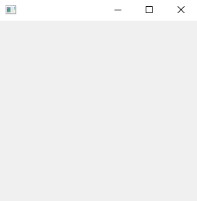
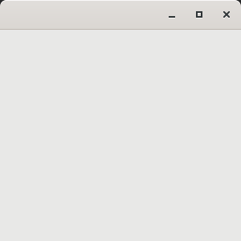
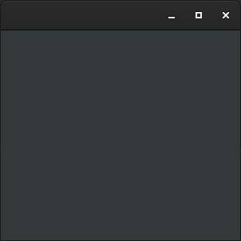

# application

Shows how to create an application with  [xtd::forms::application](../../../src/xtd_forms/include/xtd/forms/application.hpp) class.

# Sources

[src/application.cpp](src/application.cpp)

[CMakeLists.txt](CMakeLists.txt)

# Build and run

Open "Command Prompt" or "Terminal". Navigate to the folder that contains the project and type the following:

```shell
xtdc run
```

# Output

## Windows :



## macOS :


## Gnome :




