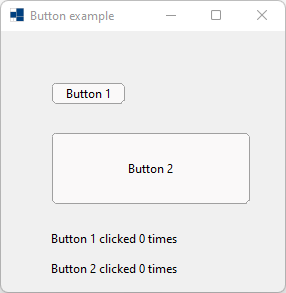
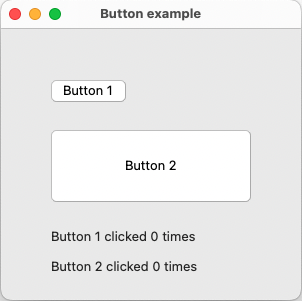
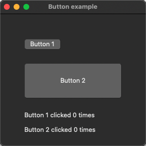
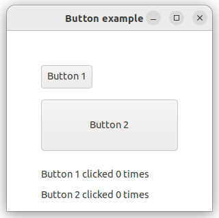
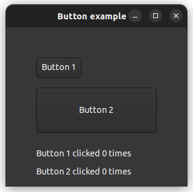

# button

demonstrates the use of xtd::forms::button control.

# Sources

[button.cpp](button.cpp)

[CMakeLists.txt](CMakeLists.txt)

# Build and run

Open "Command Prompt" or "Terminal". Navigate to the folder that contains the project and type the following:

```shell
xtd run
```

# Output

## Windows :



## macOS :





## Gnome :




