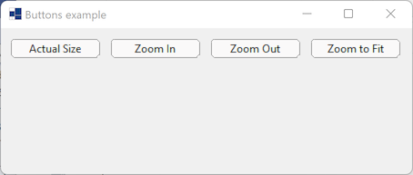
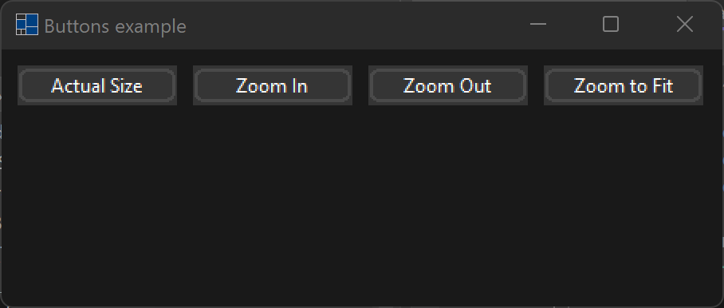
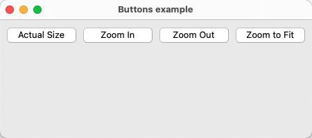
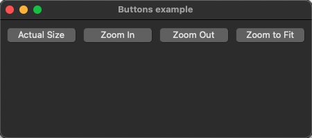
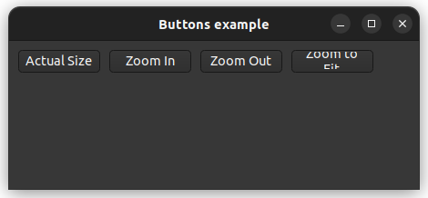

# buttons

demonstrates the use of [xtd::forms::buttons](../../../src/xtd_forms/include/xtd/forms/buttons.hpp) button object collection.

# Sources

[src/buttons.cpp](src/buttons.cpp)

[CMakeLists.txt](CMakeLists.txt)

# Build and run

Open "Command Prompt" or "Terminal". Navigate to the folder that contains the project and type the following:

```shell
xtdc run
```

# Output

## Windows :





## macOS :





## Gnome :



