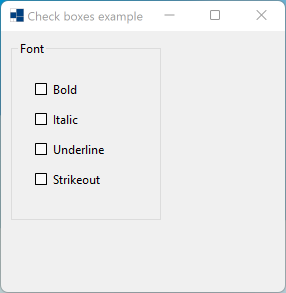
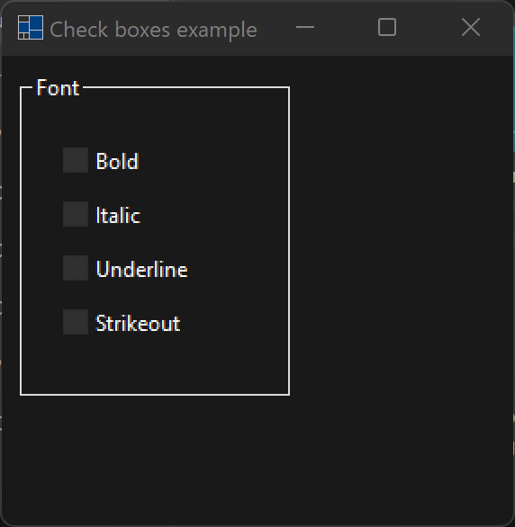
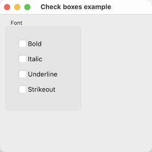
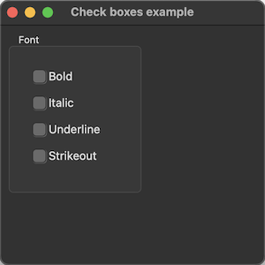
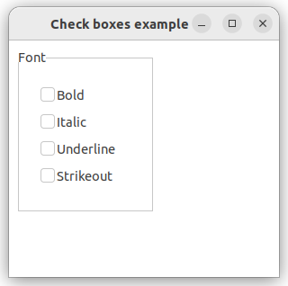

# check_boxes

demonstrates the use of [xtd::forms::check_boxes](../../../src/xtd_forms/include/xtd/forms/check_boxes.hpp) check_box object collection.

# Sources

[src/check_boxes.cpp](src/check_boxes.cpp)

[CMakeLists.txt](CMakeLists.txt)

# Build and run

Open "Command Prompt" or "Terminal". Navigate to the folder that contains the project and type the following:

```shell
xtd run
```

# Output

## Windows :





## macOS :





## Gnome :




