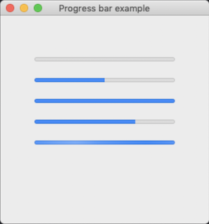
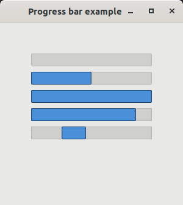
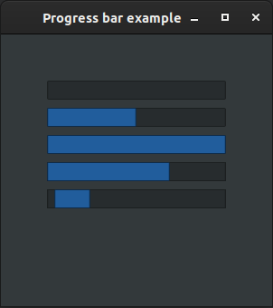

# progress_bar

demonstrates the use of [xtd::forms::progress_bar](../../../src/xtd_forms/include/xtd/forms/progress_bar.hpp) control.

# Sources

[src/progress_bar.cpp](src/progress_bar.cpp)

[CMakeLists.txt](CMakeLists.txt)

# Build and run

Open "Command Prompt" or "Terminal". Navigate to the folder that contains the project and type the following:

```shell
xtd run
```

# Output

## Windows :


## macOS :




## Gnome :




