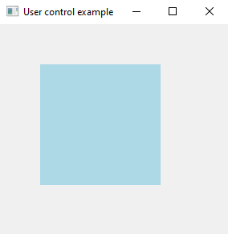
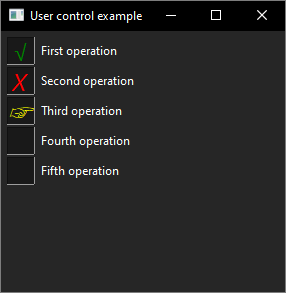
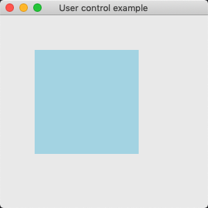
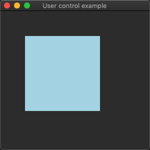
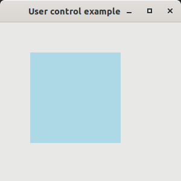
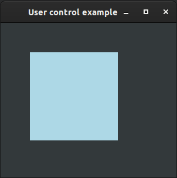

# user_control

demonstrates the use of [xtd::forms::user_control](../../../src/xtd_forms/include/xtd/forms/user_control.hpp) control.

# Sources

[src/user_control.cpp](src/user_control.cpp)

[CMakeLists.txt](CMakeLists.txt)

# Build and run

Open "Command Prompt" or "Terminal". Navigate to the folder that contains the project and type the following:

```shell
xtdc run
```

# Output

## Windows :





## macOS :





## Gnome :




