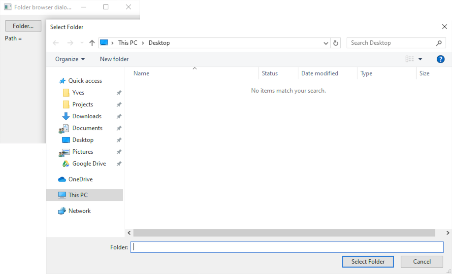
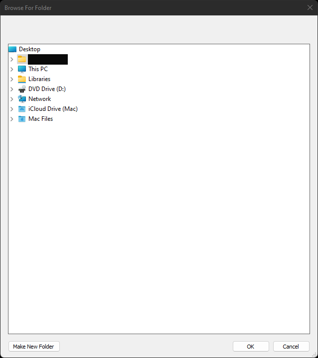
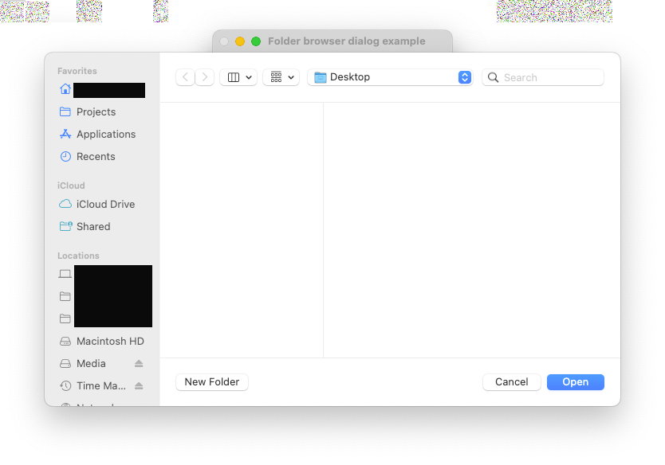
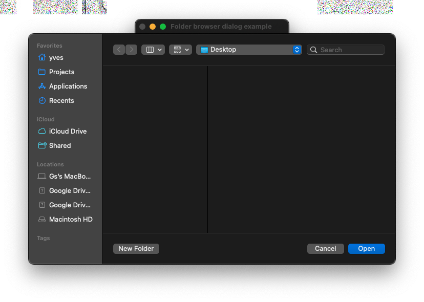
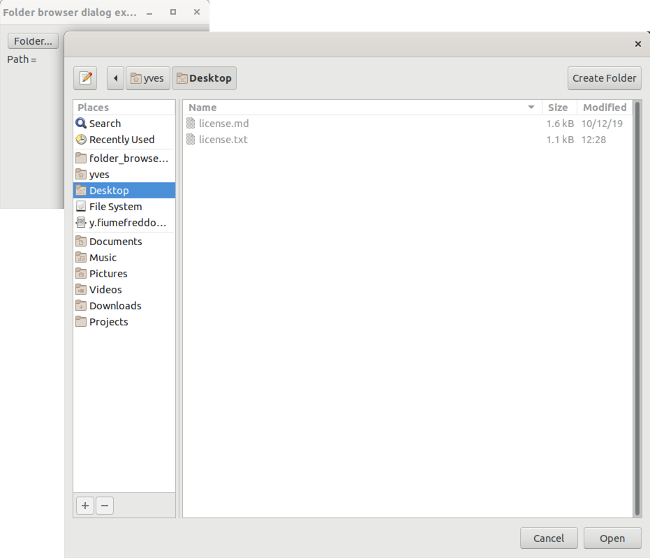
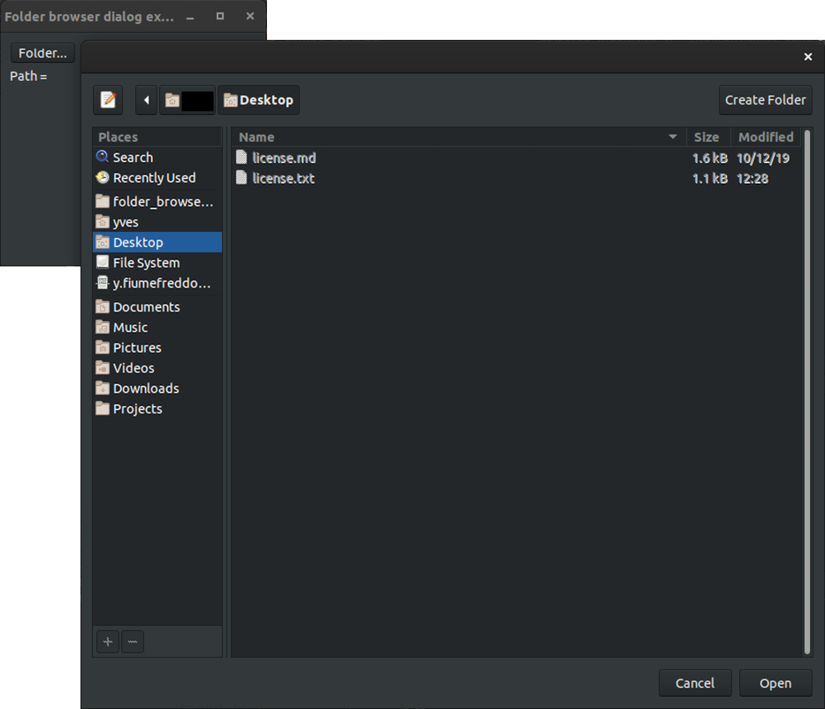

# folder_browser_dialog

demonstrates the use of [xtd::forms::folder_browser_dialog](../../../src/xtd_forms/include/xtd/forms/folder_browser_dialog.hpp) dialog.

# Sources

[src/folder_browser_dialog.cpp](src/folder_browser_dialog.cpp)

[CMakeLists.txt](CMakeLists.txt)

# Build and run

Open "Command Prompt" or "Terminal". Navigate to the folder that contains the project and type the following:

```shell
xtdc run
```

# Output

## Windows :





## macOS :





## Gnome :




