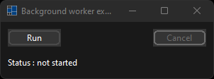
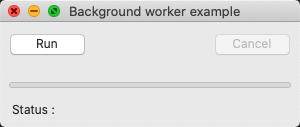
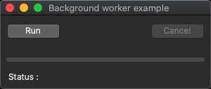

# background_worker

demonstrates the use of [xtd::forms::background_worker](../../../src/xtd_forms/include/xtd/forms/background_worker.hpp) component.

# Sources

[src/background_worker.cpp](src/background_worker.cpp)

[CMakeLists.txt](CMakeLists.txt)

# Build and run

Open "Command Prompt" or "Terminal". Navigate to the folder that contains the project and type the following:

```shell
xtd run
```

# Output

## Windows :




## macOS :





## Gnome :


