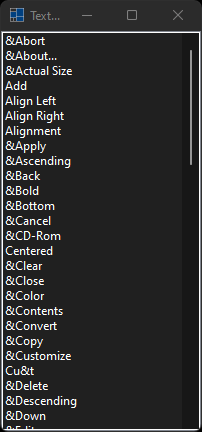

# texts

demonstrates the use of [xtd::forms::texts](../../../src/xtd_forms/include/xtd/forms/texts.hpp) strings.

# Sources

[src/texts.cpp](src/texts.cpp)

[CMakeLists.txt](CMakeLists.txt)

# Build and run

Open "Command Prompt" or "Terminal". Navigate to the folder that contains the project and type the following:

```shell
xtdc run
```

# Output

## Windows :




## macOS :


## Gnome :


