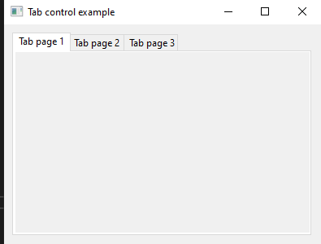
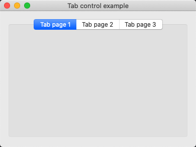
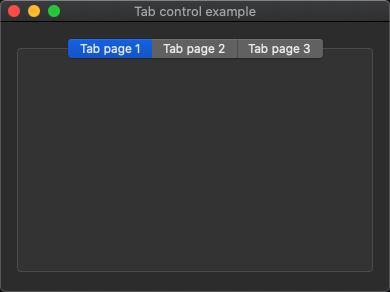
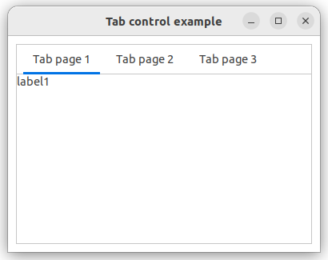
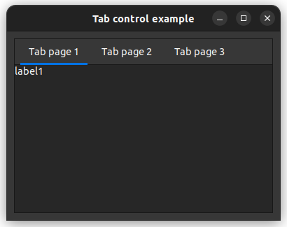

# tab_control

demonstrates the use of [xtd::forms::tab_control](../../../src/xtd_forms/include/xtd/forms/tab_control.hpp) container.

# Sources

[tab_control.cpp](tab_control.cpp)

[CMakeLists.txt](CMakeLists.txt)

# Build and run

Open "Command Prompt" or "Terminal". Navigate to the folder that contains the project and type the following:

```shell
xtd run
```

# Output

## Windows :



## macOS :





## Gnome :




