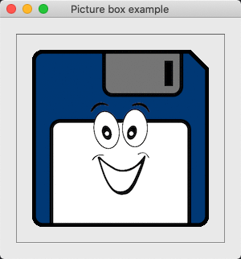
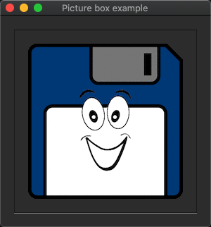
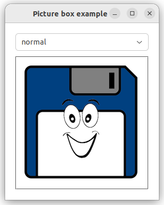
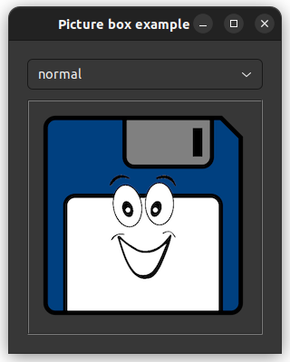

# picture_box

demonstrates the use of [xtd::forms::picture_box](../../../xtd.forms/include/xtd/forms/picture_box.hpp) control.

# Sources

[picture_box.cpp](picture_box.cpp)

[CMakeLists.txt](CMakeLists.txt)

# Build and run

Open "Command Prompt" or "Terminal". Navigate to the folder that contains the project and type the following:

```shell
xtd run
```

# Output

## Windows :


## macOS :





## Gnome :




