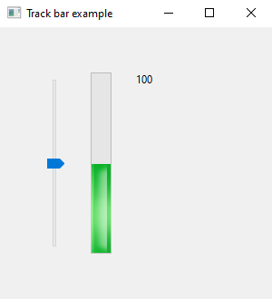
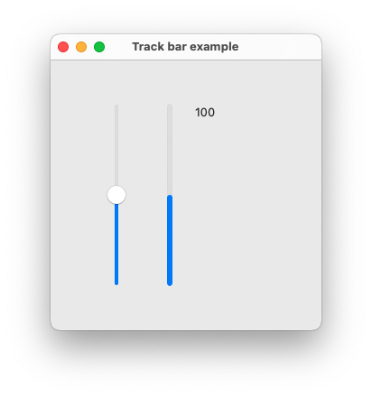

# track_bar

demonstrates the use of [xtd::forms::track_bar](../../../xtd.forms/include/xtd/forms/track_bar.hpp) control.

# Sources

[track_bar.cpp](track_bar.cpp)

[CMakeLists.txt](CMakeLists.txt)

# Build and run

Open "Command Prompt" or "Terminal". Navigate to the folder that contains the project and type the following:

```shell
xtd run
```

# Output

## Windows :



## macOS :




## Gnome :


