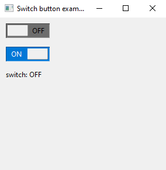
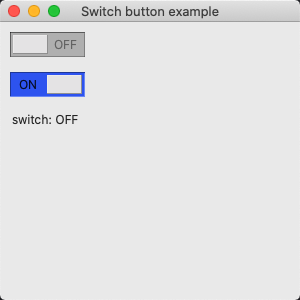
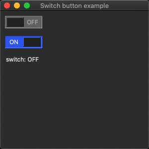
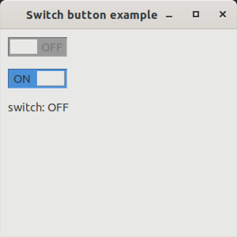
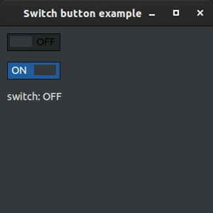

# switch_button

demonstrates how to create a custom control with [xtd::forms::user_control](../../../src/xtd_forms/include/xtd/forms/user_control.hpp) control.

# Sources

[switch_button.cpp](switch_button.cpp)

[CMakeLists.txt](CMakeLists.txt)

# Build and run

Open "Command Prompt" or "Terminal". Navigate to the folder that contains the project and type the following:

```shell
xtd run
```

# Output

## Windows :



## macOS :





## Gnome :




