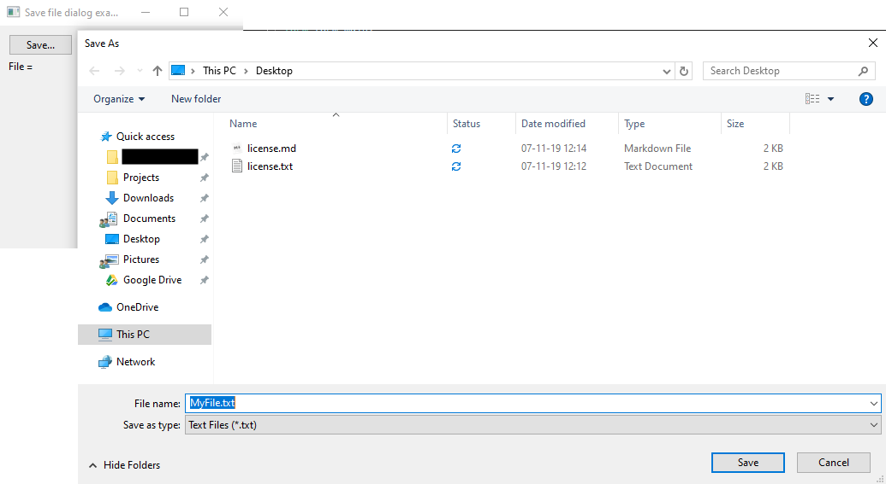
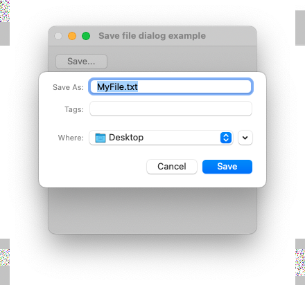
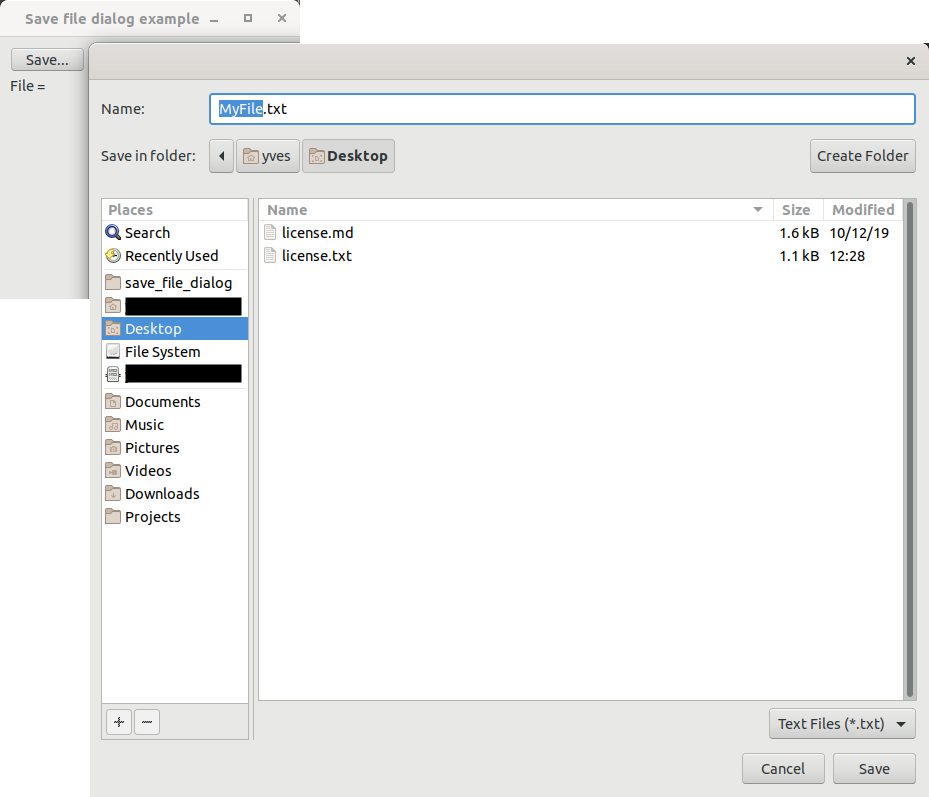
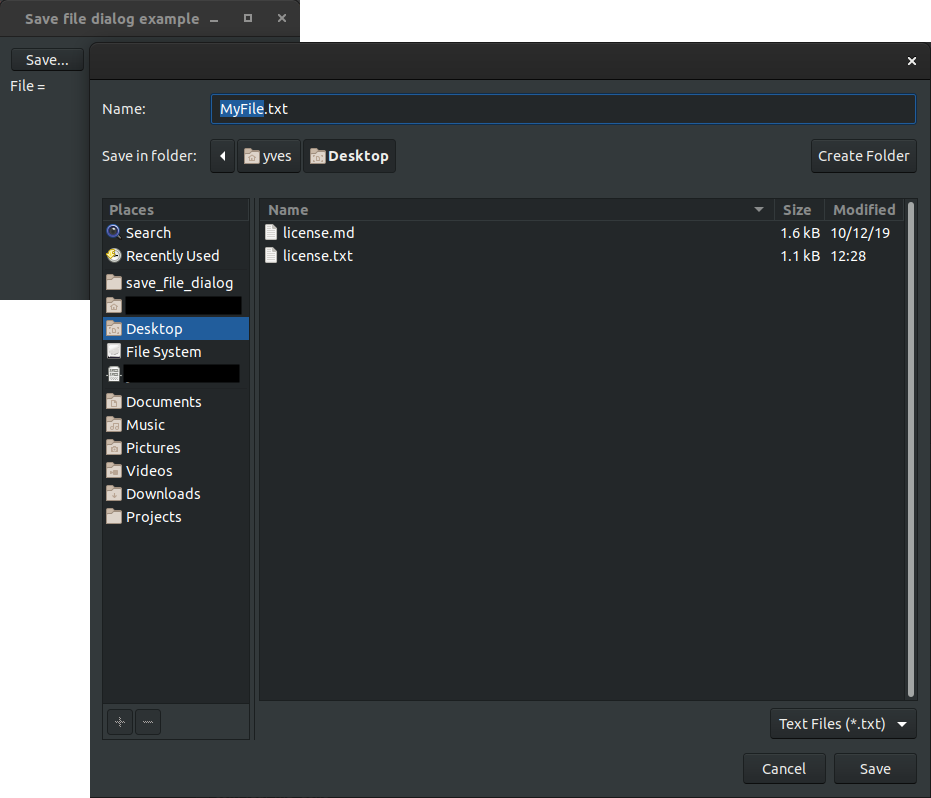

# save_file_dialog

demonstrates the use of [xtd::forms::save_file_dialog](../../../src/xtd_forms/include/xtd/forms/save_file_dialog.hpp) dialog.

# Sources

[save_file_dialog.cpp](save_file_dialog.cpp)

[CMakeLists.txt](CMakeLists.txt)

# Build and run

Open "Command Prompt" or "Terminal". Navigate to the folder that contains the project and type the following:

```shell
xtd run
```

# Output

## Windows :



## macOS :




## Gnome :




