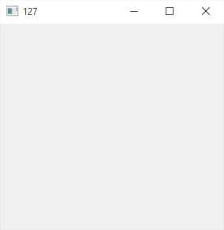
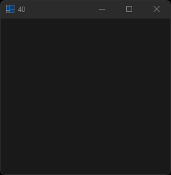
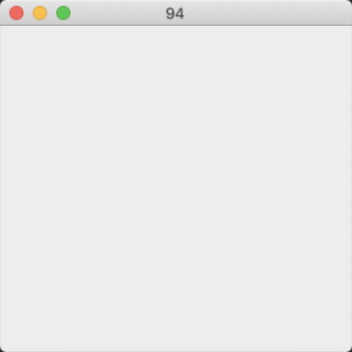
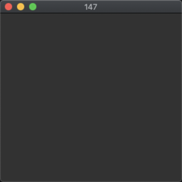
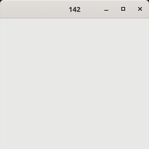
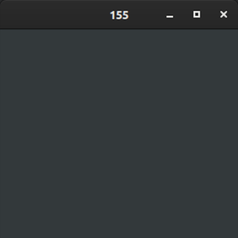

# application_idle

demonstrates the use of [idle](../../../src/xtd_forms/include/xtd/forms/application.hpp) event.

# Sources

[src/application_idle.cpp](src/application_idle.cpp)

[CMakeLists.txt](CMakeLists.txt)

# Build and run

Open "Command Prompt" or "Terminal". Navigate to the folder that contains the project and type the following:

```shell
xtd run
```

# Output

## Windows :





## macOS :





## Gnome :




