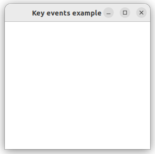

# key_events

demonstrates some events received by [form](../../../src/xtd_forms/include/xtd/forms/form.hpp).

# Sources

[src/key_events.cpp](src/key_events.cpp)

[CMakeLists.txt](CMakeLists.txt)

# Build and run

Open "Command Prompt" or "Terminal". Navigate to the folder that contains the project and type the following:

```shell
xtd run
```

# Output

## Windows :


## macOS :


## Gnome :




