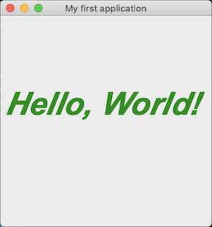
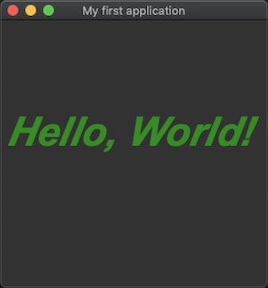

# hello_world_forms

The classic first application "Hello, World!" with xtd::forms::label control.

# Sources

[hello_world_form.cpp](hello_world_forms.cpp)

[CMakeLists.txt](CMakeLists.txt)

# Build and run

Open "Command Prompt" or "Terminal". Navigate to the folder that contains the project and type the following:

```shell
xtd run
```

# Output

Windows :


macOS :





Gnome :


