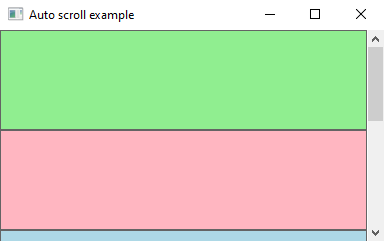
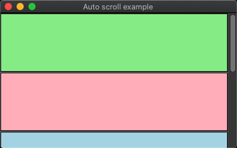
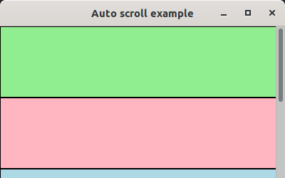
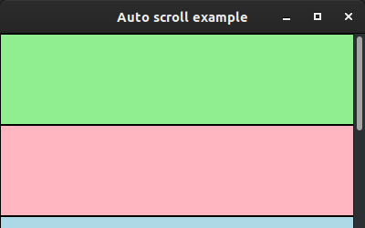

# auto_scroll

demonstrates the use of [xtd::forms::panel](../../../src/xtd_forms/include/xtd/forms/panel.hpp) container with [xtd::forms/scrollable_control::auto_scroll](../../../src/xtd_forms/include/xtd/forms/scrollable_control.hpp).

# Sources

[src/auto_scroll.cpp](src/auto_scroll.cpp)

[CMakeLists.txt](CMakeLists.txt)

# Build and run

Open "Command Prompt" or "Terminal". Navigate to the folder that contains the project and type the following:

```shell
xtd run
```

# Output

## Windows :




## macOS :




## Gnome :




