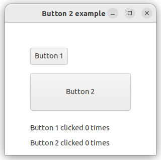
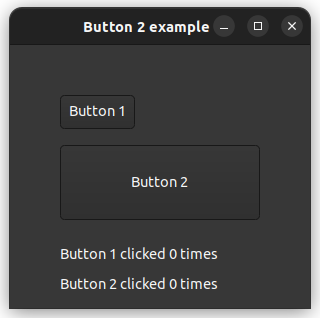

# button2

demonstrates the use of [xtd::forms::form](../../../src/xtd_forms/include/xtd/forms/button.hpp) control.

# Sources

[src/button2.cpp](src/button2.cpp)

[CMakeLists.txt](CMakeLists.txt)

# Build and run

Open "Command Prompt" or "Terminal". Navigate to the folder that contains the project and type the following:

```shell
xtdc run
```

# Output

## Windows :


## macOS :


## Gnome :




