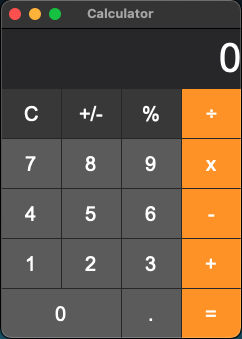

# calculator

represents a window or dialog box that makes up an application's user interface.

# Sources

[src/calculator.cpp](src/calculator.cpp)

[CMakeLists.txt](CMakeLists.txt)

# Build and run

Open "Command Prompt" or "Terminal". Navigate to the folder that contains the project and type the following:

```shell
xtdc run
```

# Output

## Windows :


## macOS :




## Gnome :


