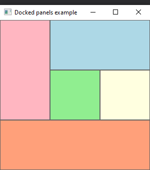
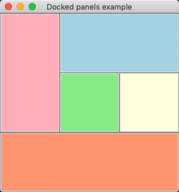
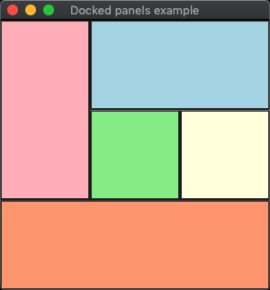
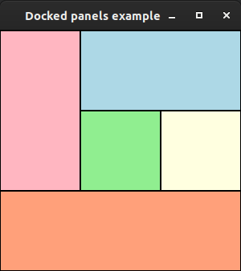

# docked_panels

demonstrates the use of [xtd::forms::panel](../../../src/xtd_forms/include/xtd/forms/panel.hpp) container with [xtd::forms::dock_style](../../../src/xtd_forms/include/xtd/forms/dock_style.hpp).

# Sources

[src/docked_panels.cpp](src/docked_panels.cpp)

[CMakeLists.txt](CMakeLists.txt)

# Build and run

Open "Command Prompt" or "Terminal". Navigate to the folder that contains the project and type the following:

```shell
xtdc run
```

# Output

## Windows :




## macOS :





## Gnome :



