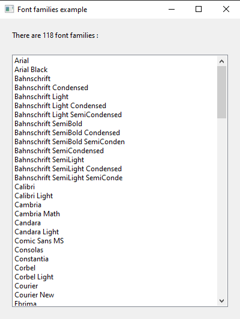
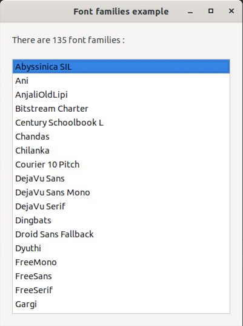

# font_family

demonstrates the use of xtd::drawing::font_family class.

# Sources

[src/font_family.cpp](src/font_family.cpp)

[CMakeLists.txt](CMakeLists.txt)

# Build and run

Open "Command Prompt" or "Terminal". Navigate to the folder that contains the project and type the following:

```shell
xtdc run
```

# Output

## Windows :




## macOS :


## Gnome :




