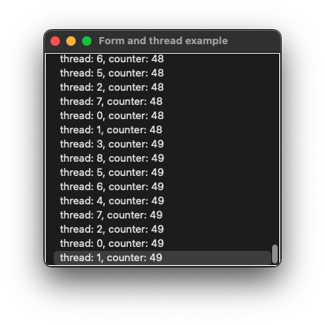

# form_and_thread

demonstrates how a thread can update ui with [xtd::forms::control::invoke](../../../src/xtd_forms/include/xtd/forms/form.hpp) method.

# Sources

[src/form_and_thread.cpp](src/form_and_thread.cpp)

[CMakeLists.txt](CMakeLists.txt)

# Build and run

Open "Command Prompt" or "Terminal". Navigate to the folder that contains the project and type the following:

```shell
xtdc run
```

# Output

## Windows :


## macOS :




## Gnome :


