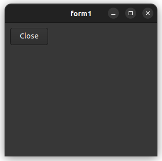

# form2

This example demontrate how to launch form as normal window, modeless window and modal window.

# Sources

[src/form2.cpp](src/form2.cpp)

[CMakeLists.txt](CMakeLists.txt)

# Build and run

Open "Command Prompt" or "Terminal". Navigate to the folder that contains the project and type the following:

```shell
xtdc run
```

# Output

## Windows :


## macOS :


## Gnome :



