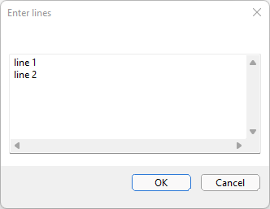
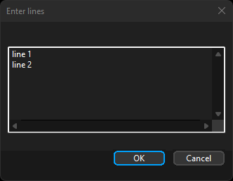
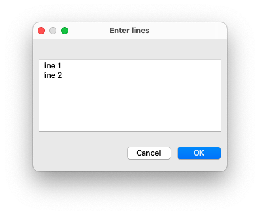
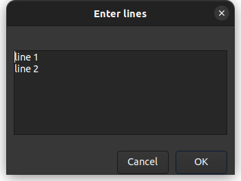

# input_dialog_multiline

demonstrates the use of [xtd::forms::input_dialog](../../../src/xtd_forms/include/xtd/forms/input_dialog.hpp) dialog.

# Sources

[src/input_dialog_multiline.cpp](src/input_dialog_multiline.cpp)

[CMakeLists.txt](CMakeLists.txt)

# Build and run

Open "Command Prompt" or "Terminal". Navigate to the folder that contains the project and type the following:

```shell
xtdc run
```

# Output

## Windows :





## macOS :




## Gnome :



