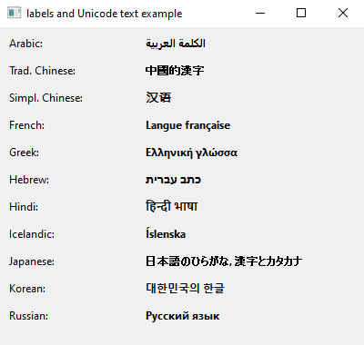
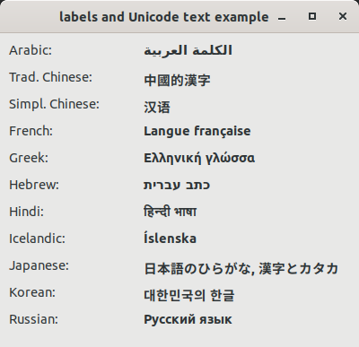
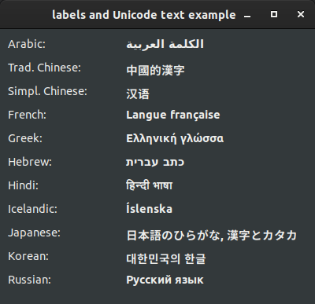

# labels_and_unicode_text

demonstrates the use of [xtd::forms::label](../../../xtd.forms/include/xtd/forms/label.hpp) control with unicode text.

# Sources

[labels_and_unicode_text.cpp](labels_and_unicode_text.cpp)

[CMakeLists.txt](CMakeLists.txt)

# Build and run

Open "Command Prompt" or "Terminal". Navigate to the folder that contains the project and type the following:

```shell
xtd run
```

# Output

## Windows :



## macOS :


## Gnome :




