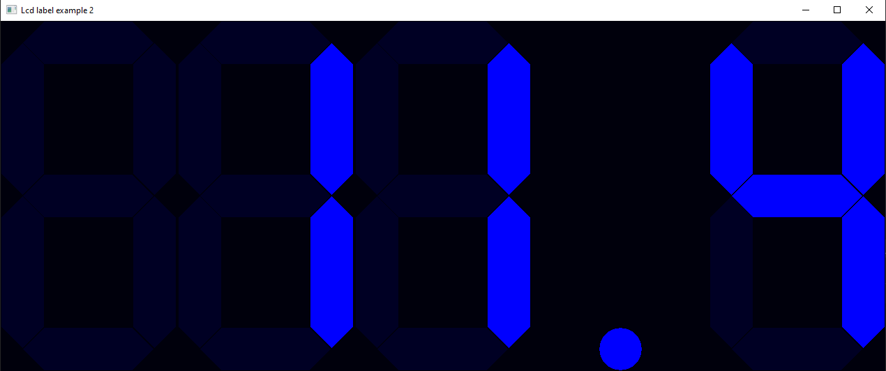
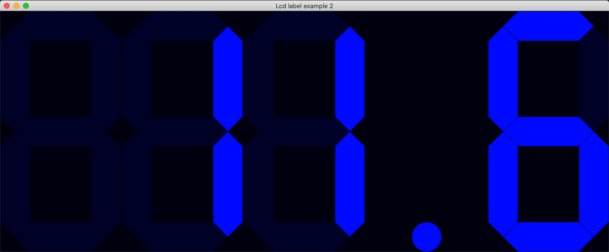

# lcd_label2

demonstrates how to use [xtd::forms::lcd_label](../../../src/xtd_forms/include/xtd/forms/lcd_label.hpp) control.

# Sources

[src/lcd_label2.cpp](src/lcd_label2.cpp)

[CMakeLists.txt](CMakeLists.txt)

# Build and run

Open "Command Prompt" or "Terminal". Navigate to the folder that contains the project and type the following:

```shell
xtd run
```

# Output

## Windows :




## macOS :




## Gnome :


