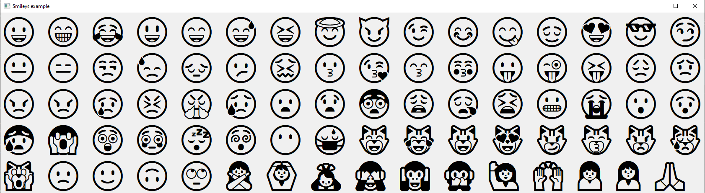
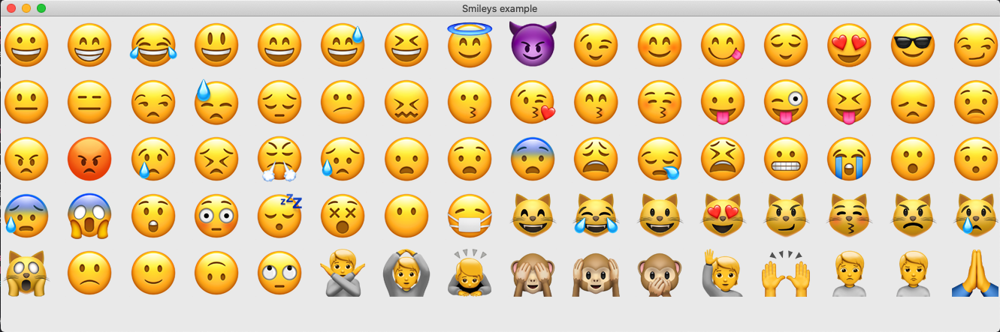
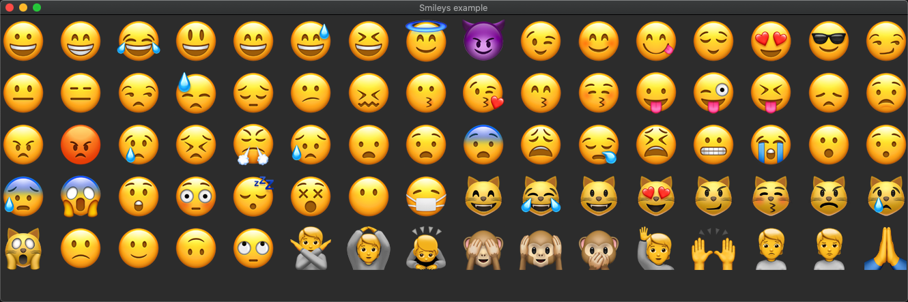
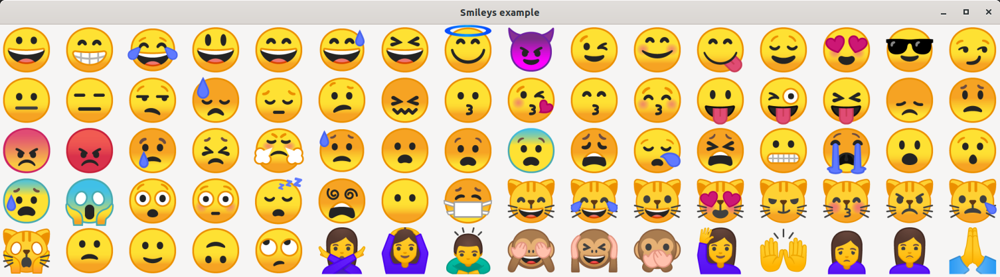

# smileys

demonstrates the use of [xtd::forms::label](../../../src/xtd_forms/include/xtd/forms/label.hpp) control.

# Sources

[src/smileys.cpp](src/smileys.cpp)

[CMakeLists.txt](CMakeLists.txt)

# Build and run

Open "Command Prompt" or "Terminal". Navigate to the folder that contains the project and type the following:

```shell
xtd run
```

# Output

## Windows :




## macOS :





## Gnome :




