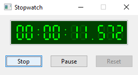
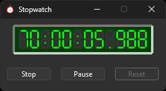
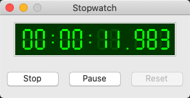
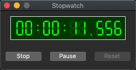
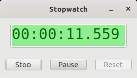
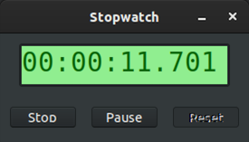

# stopwatch_form

demonstrates the use of [xtd::forms::button](../../../src/xtd_forms/include/xtd/forms/button.hpp), [xtd::forms::label](../../../src/xtd_forms/include/xtd/forms/button.hpp) controls and  [xtd::forms::timer](../../../src/xtd_forms/include/xtd/forms/timer.hpp) component.

# Sources

[src/stopwatch_form.cpp](ssrc/topwatch_form.cpp)

[CMakeLists.txt](CMakeLists.txt)

# Build and run

Open "Command Prompt" or "Terminal". Navigate to the folder that contains the project and type the following:

```shell
xtd run
```

# Output

## Windows :





## macOS :





## Gnome :




