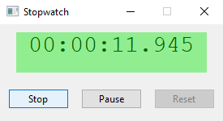
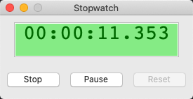
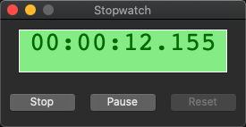

# stop_watch_form

demonstrates the use of [xtd::forms::button](../../../xtd.forms/include/xtd/forms/button.hpp), [xtd::forms::label](../../../xtd.forms/include/xtd/forms/button.hpp) controls and  [xtd::forms::timer](../../../xtd.forms/include/xtd/forms/timer.hpp) component.

# Sources

[stop_watch_form.cpp](stop_watch_form.cpp)

[CMakeLists.txt](CMakeLists.txt)

# Build and run

Open "Command Prompt" or "Terminal". Navigate to the folder that contains the project and type the following:

```shell
xtd run
```

# Output

## Windows :



## macOS :





## Gnome :


