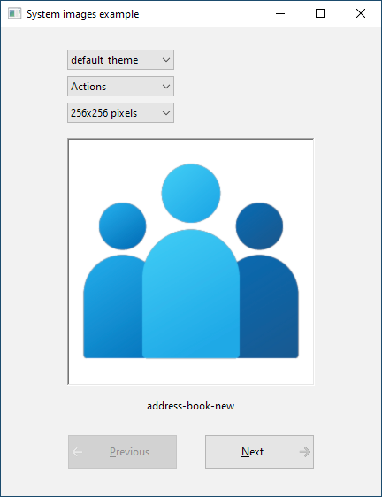
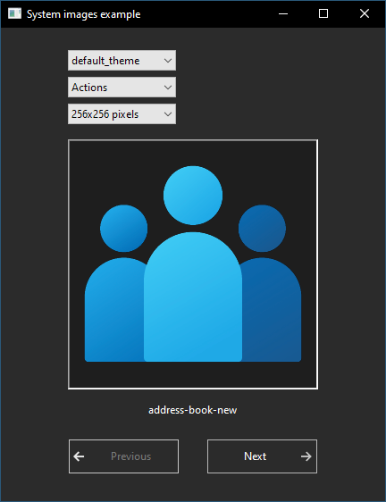
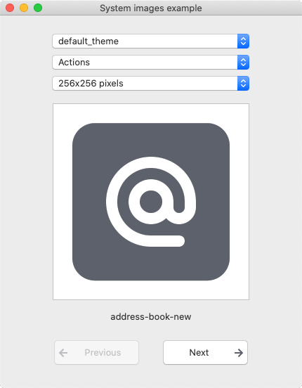
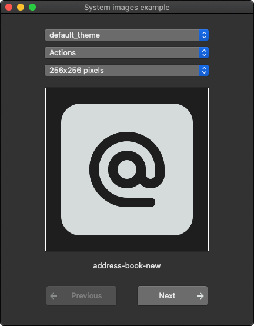
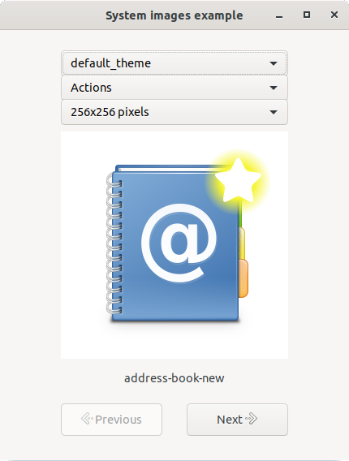

# system_images

demonstrates the use of **xtd::drawing::system_images** component.

# Sources

[src/system_images.cpp](src/system_images.cpp)

[CMakeLists.txt](CMakeLists.txt)

# Build and run

Open "Command Prompt" or "Terminal". Navigate to the folder that contains the project and type the following:

```shell
xtdc run
```

# Output

## Windows :





## macOS :





## Gnome :




