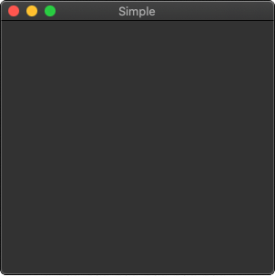

# First programs in xtd_forms

In this chapter, we will cover the basics needed to create xtd_forms applications. We will create our first simple example, show how to display an icon. Next we will create a simple example demonstrating usage of an event. Finally, we will see how widgets communicate in xtd_forms applications.

## A simple application

First we create the very basic xtd_forms program.

```c++
#include <xtd/xtd.forms>

namespace tutorial {
  class simple : public xtd::forms::form {
  public:
    simple() {
      text("Simple");
      start_position(xtd::forms::form_start_position::center_screen);
    }

    static void main() {
      xtd::forms::application::run(simple());
    }
  };
}

startup_(tutorial::simple);
```

This very basic example shows a small window on the screen. The window is centered.

```c++
start_position(xtd::forms::form_start_position::center_screen);
```

This method centers the form on the screen, both horizontally and vertically.

```c++
startup_(tutorial::simple);
```

The code behind startup_ macro can be replaced by :

```c++
int main(int argc, char* argv[]) {
  tutorial::simple::main();
  return xtd::environment::exit_code();
}
```

This example can be build on Windows, macOS or linux operating system with CMake.

```cmake
cmake_minimum_required(VERSION 3.3)

project(simple)
find_package(xtd.forms REQUIRED)
add_sources(src/simple.cpp)
target_type(GUI_APPLICATION)
```

See [cmake](htps:\\cmake.org) for more information.



Figure: simple

## Application icon

In this example, we provide an icon for our application. It became a standard to display a small icon in the upper left corner of the window. The icon is a graphical identity of the program.

```c++
#include <xtd/xtd.forms>

namespace tutorial {
  class form_icon : public xtd::forms::form {
  public:
    form_icon() {
      text("Icon");
      start_position(xtd::forms::form_start_position::center_screen);
      icon(xtd::drawing::system_icons::gammasoft());
    }

    static void main() {
      xtd::forms::application::run(form_icon());
    }
  };
}

startup_(tutorial::form_icon);
```

In our example we show a small gammasoft icon.

```c++
icon(xtd::drawing::system_icons::gammasoft());
```

To display an application icon is a matter of one code line.


Figure: icon

## A simple button

In the following example, we create a button on the form control. We will show, how to create a simple event handler.

```c++
#include <xtd/xtd.forms>

namespace tutorial {
  class form_button : public xtd::forms::form {
  public:
    form_button() {
      text("Button");
      start_position(xtd::forms::form_start_position::center_screen);
      
      button_quit.parent(*this);
      button_quit.location({20, 20});
      button_quit.text("Quit");
      button_quit.click += xtd::event_handler<xtd::forms::control&>(*this, &form_button::on_quit);
    }

    static void main() {
      xtd::forms::application::run(form_button());
    }
    
  private:
    void on_quit(xtd::forms::control& sender, const xtd::event_args& e) {
      close();
    }
    
    xtd::forms::button button_quit;
  };
}

startup_(tutorial::form_button);
```

```c++
xtd::forms::button button_quit;
```

First we create a button control. 

```c++
button_quit.parent(*this);
button_quit.location({20, 20});
button_quit.text("Quit");
```

It will be placed inside a form control.