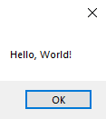
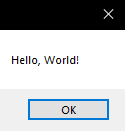
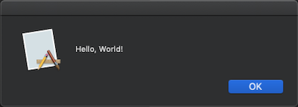
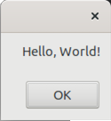
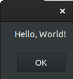

# action2

This example simplifies this code by instantiating the xtd::action delegate instead of explicitly defining a new delegate and assigning a named method to it.

## Sources

[src/action2.cpp](src/action2.cpp)

[CMakeLists.txt](CMakeLists.txt)

# Build and run

Open "Command Prompt" or "Terminal". Navigate to the folder that contains the project and type the following:

```cmake
xtdc run
```

* If action1 is called without param

# Output

```
Hello, World!
```

* If Action1 is called with any param

# Output

## Windows :





## macOS :




## Linux Gnome :




