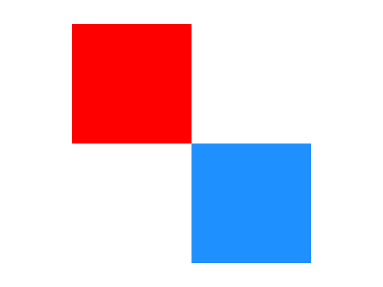

# graphics_fill_rectangle

Demonstrates how to use [xtd::drawing::graphics::fill_rectangle](https://gammasoft71.github.io/xtd/reference_guides/latest/classxtd_1_1drawing_1_1graphics.html#a86bc3584a533000e580ea299fc80aa3e) method.

## Sources

* [src/graphics_fill_rectangle.cpp](src/graphics_fill_rectangle.cpp)
* [CMakeLists.txt](CMakeLists.txt)

## Build and run

Open "Command Prompt" or "Terminal". Navigate to the folder that contains the project and type the following:

```shell
xtdc run
```

## Output


