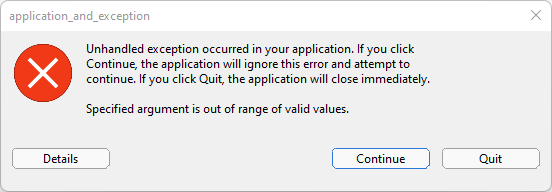
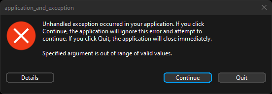
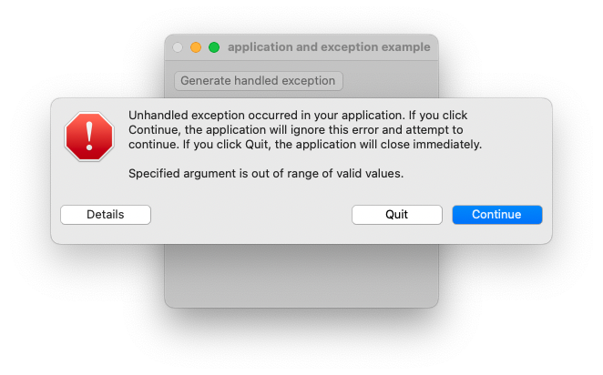
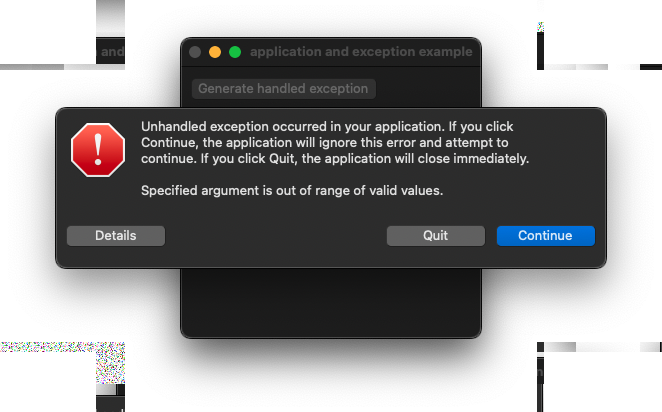
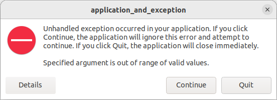
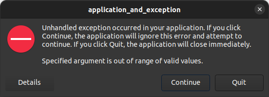

# application_and_exception

Shows how to create an application with  [xtd::forms::application](https://gammasoft71.github.io/xtd/reference_guides/latest/classxtd_1_1forms_1_1application.html) class and how to manage exception.

## Sources

* [src/application_and_exception.cpp](src/application_and_exception.cpp)
* [CMakeLists.txt](CMakeLists.txt)

## Build and run

Open "Command Prompt" or "Terminal". Navigate to the folder that contains the project and type the following:

```shell
xtdc run
```

## Output

### Windows :





### macOS :





### Gnome :




