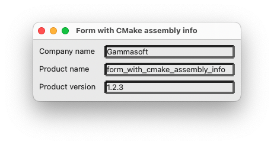
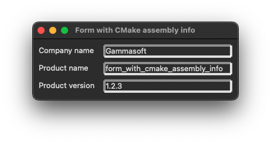

# application_with_cmake_assembly_info

This example demonstrates the use of [xtd::reflection::assembly](https://gammasoft71.github.io/xtd/reference_guides/latest/classxtd_1_1reflection_1_1assembly.html) attributes, [xtd::forms::form](https://gammasoft71.github.io/xtd/reference_guides/latest/classxtd_1_1forms_1_1form.html) classes.

## Sources

* [src/application_with_cmake_assembly_info.cpp](src/application_with_cmake_assembly_info.cpp)
* [properties/assembly_info.cmake](properties/assembly_info.cmake)
* [CMakeLists.txt](CMakeLists.txt)

## Build and run

Open "Command Prompt" or "Terminal". Navigate to the folder that contains the project and type the following:

```shell
xtdc run
```

## Output

## Windows :


## macOS :





## Gnome :


