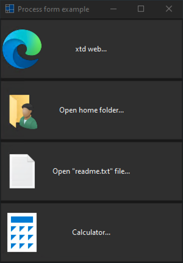
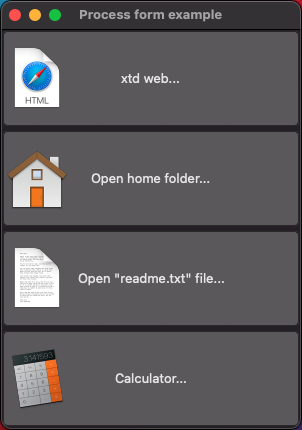

# process_form

Shows how to launch process from forms.

# Sources

[src/process_form.cpp](src/process_form.cpp)

[CMakeLists.txt](CMakeLists.txt)

# Build and run

Open "Command Prompt" or "Terminal". Navigate to the folder that contains the project and type the following:

```shell
xtdc run
```

# Output

## Windows :




## macOS :




## Gnome :


