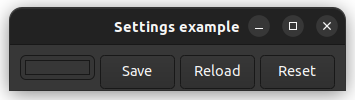

# settings_example

demonstrates the use of [xtd::forms::settings](https://gammasoft71.github.io/xtd/reference_guides/latest/classxtd_1_1forms_1_1settings.html) component.

## Sources

* [src/settings_example.cpp](src/settings_example.cpp)
* [properties/settings.cmake](properties/settings.cmake)
* [CMakeLists.txt](CMakeLists.txt)


## Build and run

Open "Command Prompt" or "Terminal". Navigate to the folder that contains the project and type the following:

```shell
xtdc run
```

## Output

## Windows :


## macOS :


## Gnome :



