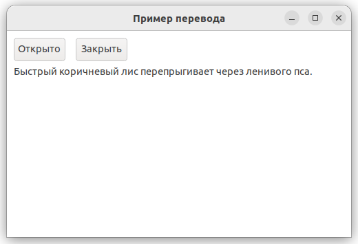

# translator

demonstrates the use of [xtd::forms::translator](../../../../src/xtd.core/include/xtd/translator.h) strings.

# Sources

* [src/translator.cpp](src/translator.cpp)
* [locale/en/locale.strings](locale/en/locale.strings)
* [locale/es/locale.strings](locale/es/locale.strings)
* [locale/fr/locale.strings](locale/fr/locale.strings)
* [locale/ru/locale.strings](locale/ru/locale.strings)
* [CMakeLists.txt](CMakeLists.txt)

# Build and run

Open "Command Prompt" or "Terminal". Navigate to the folder that contains the project and type the following:

```shell
xtdc run
```

# Output

## Windows :


## macOS :


## Gnome :




