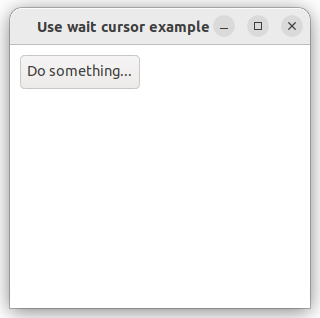

# use_wait_cursor

Shows how to create an use_wait_cursor with  [xtd::forms::application](../../../../src/xtd.forms/include/xtd/forms/application.h) class.

# Sources

* [src/use_wait_cursor.cpp](src/use_wait_cursor.cpp)
* [CMakeLists.txt](CMakeLists.txt)

# Build and run

Open "Command Prompt" or "Terminal". Navigate to the folder that contains the project and type the following:

```shell
xtdc run
```

# Output

## Windows :


## macOS :


## Gnome :




